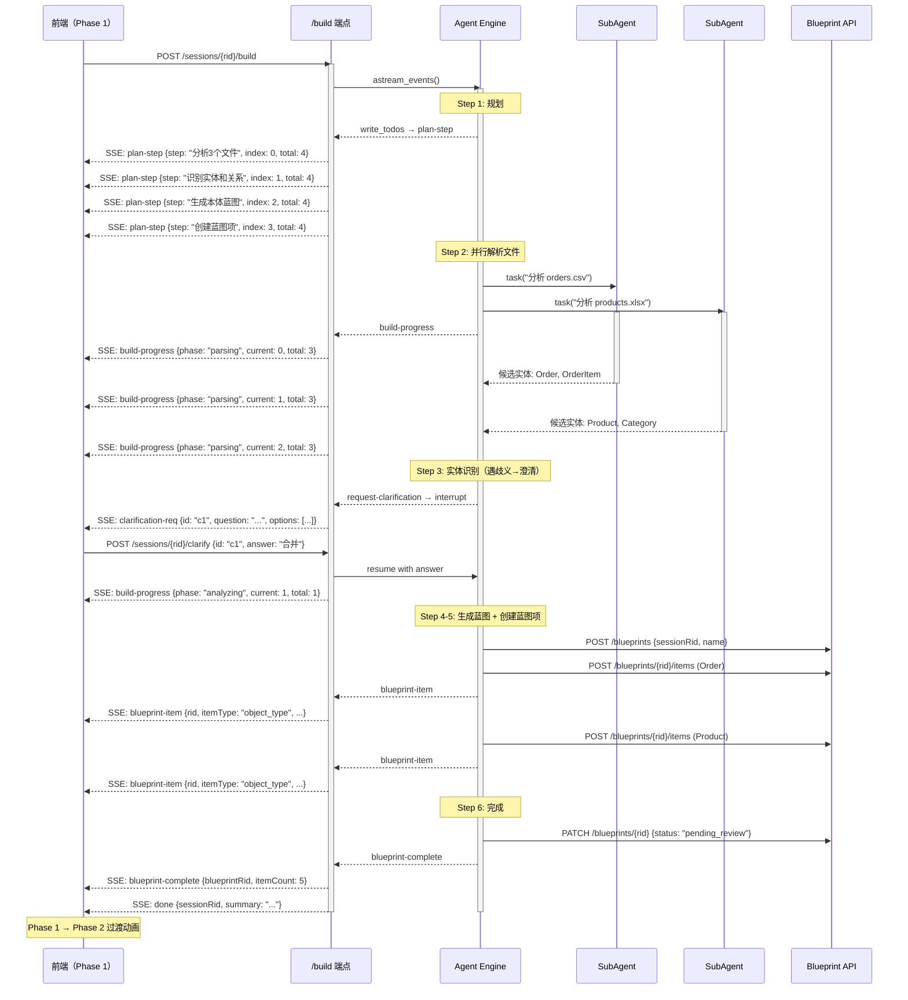

# 07 - Agent 自主构建本体 / Autonomous Ontology Building

> **版本**: v0.2.1
> **日期**: 2026-03-26
> **前置文档**: [03-agent-context-architecture.md](./03-agent-context-architecture.md), [v0.2.1 Workshop 体验改进 PRD](../prd/0.2.1/Workshop%20体验改进%20PRD.md)
> **关联 Feature**: F012 Agent Foundation, F013 CLI & Skills, F014 Material & Blueprint, F015 Workshop Foundation

---

## 一、概述

### 1.1 文档目的

本文档是 v0.2.1 改进二"Agent 自主构建本体"的技术方案，覆盖从框架理解到架构设计的完整内容：

- **Part I**（§二~§三）：deepagents 框架介绍——帮助开发者理解底层 Agent 引擎的核心概念
- **Part II**（§四~§十）：自主构建架构设计——Phase 1 全自动本体构建的具体技术方案

### 1.2 问题定义

当前 v0.2.0 的 Agent 交互模式是**被动响应**：用户在 Chat 面板发送消息，Agent 响应一条消息。构建本体需要用户手动触发多轮对话（"分析这个文件" → "生成蓝图" → "创建实体"），流程碎片化。

改进后的目标是**全自动构建**：用户在 Phase 0 填写领域引导 + 上传文件 → 点击"开始构建" → Agent 自主完成素材分析、实体识别、蓝图生成的全流程，期间通过 SSE 实时推送进度和结果到 3D 画布。

```
┌──────────────────────────────────────────────────────────────────┐
│                     现状 vs 目标                                  │
├─────────────────────────────┬────────────────────────────────────┤
│ 现状（被动响应）              │ 目标（自主构建）                    │
├─────────────────────────────┼────────────────────────────────────┤
│ 用户: "分析 orders.csv"     │ 用户: 点击 [开始构建]               │
│ Agent: 分析结果...           │     ↓                              │
│ 用户: "生成蓝图"             │ Agent 自主:                         │
│ Agent: 蓝图已生成...         │   1. 规划分析计划                   │
│ 用户: "应用蓝图"             │   2. 解析所有文件                   │
│ Agent: 已创建 3 个 OT...    │   3. 识别实体和关系                 │
│                             │   4. 生成本体蓝图                   │
│ 3 轮手动对话                │   5. 逐项创建蓝图项                 │
│ 用户认知负担高               │      ↓                              │
│                             │ 前端实时展示星体结晶动画             │
│                             │ 0 轮手动对话，全程自动               │
└─────────────────────────────┴────────────────────────────────────┘
```

### 1.3 设计目标

| 目标 | 说明 |
|------|------|
| **全自动** | 一键触发后 Agent 自主完成端到端构建，无需用户手动发消息 |
| **可观测** | 通过 SSE 事件流实时推送构建进度，前端可视化呈现 |
| **可中断** | Agent 遇到歧义时主动澄清，等待用户回答后继续 |
| **可恢复** | 网络中断或异常后，基于 Checkpoint 恢复构建进度 |
| **可降级** | Token 预算耗尽或部分文件解析失败时，优雅保存已完成部分 |

---

## Part I: deepagents 框架介绍

## 二、deepagents 核心架构

Open Ontology 的 Agent 引擎基于 [deepagents](https://github.com/anthropics/deepagents) v0.4.12 构建。deepagents 是一个基于 LangGraph 的 Agent 框架，提供中间件化的 Agent 组装能力。

### 2.1 Agent 工厂：`create_deep_agent()`

`create_deep_agent()` 是 deepagents 的核心入口，返回一个编译好的 LangGraph `CompiledStateGraph`。

```python
from deepagents import create_deep_agent

agent = create_deep_agent(
    model="claude-sonnet-4-6",           # LLM 模型（字符串或实例）
    system_prompt="...",                   # 系统提示（追加到 base_prompt 之后）
    skills=["/path/to/skills"],            # Skill 目录列表
    middleware=[...],                      # 额外中间件
    subagents=[...],                       # 子 Agent 定义
    checkpointer=postgres_checkpointer,    # 状态持久化
    interrupt_on={"tool_name": True},      # 工具级 HITL 中断
    backend=FilesystemBackend(),            # 文件操作后端
    recursion_limit=50,                    # 最大步数
)

# 返回的 agent 是 LangGraph CompiledStateGraph
# 通过 astream_events() 获取流式事件
async for event in agent.astream_events(
    {"messages": [...]},
    config={"configurable": {"thread_id": "session-123"}},
    version="v2",
):
    ...
```

**关键参数说明**：

| 参数 | 类型 | 说明 |
|------|------|------|
| `model` | `str \| BaseChatModel` | LLM 模型。字符串格式：`"claude-sonnet-4-6"` 或 `"openai:gpt-4o"` |
| `system_prompt` | `str` | 追加到 deepagents 内置 base_prompt 之后的自定义指令 |
| `skills` | `list[str]` | Skill 源目录路径列表，支持多源叠加（后者覆盖前者） |
| `middleware` | `list[AgentMiddleware]` | 额外中间件（追加到默认栈之后） |
| `subagents` | `list[SubAgent]` | 自定义子 Agent 定义（补充默认的 general-purpose 子 Agent） |
| `checkpointer` | `Checkpointer` | LangGraph Checkpointer 实例，用于状态持久化和中断恢复 |
| `interrupt_on` | `dict[str, bool]` | 工具级 HITL 中断配置——指定哪些工具调用后暂停等待人类输入 |
| `backend` | `BackendProtocol` | 文件操作后端（StateBackend 内存态 / FilesystemBackend 真实文件系统） |
| `recursion_limit` | `int` | Agent 最大执行步数，防止无限循环（默认 50） |

### 2.2 中间件栈

deepagents 采用中间件架构，每层中间件通过 `before_agent` 和 `awrap_model_call` 钩子注入能力。默认中间件栈（按执行顺序）：

```
┌──────────────────────────────────────────────────────────────┐
│                   LLM（Claude / GPT）                        │
└──────────────────────────┬───────────────────────────────────┘
                           │ awrap_model_call
┌──────────────────────────┴───────────────────────────────────┐
│ ① TodoListMiddleware         规划：write_todos 工具          │
│ ② MemoryMiddleware           记忆：AGENTS.md 持久化上下文     │
│ ③ SkillsMiddleware           技能：渐进式加载 SKILL.md       │
│ ④ FilesystemMiddleware       文件：ls/read/write/edit/glob   │
│ ⑤ SubAgentMiddleware         委派：task() 派生隔离子 Agent   │
│ ⑥ SummarizationMiddleware    压缩：自动/手动上下文压缩       │
│ ⑦ PromptCachingMiddleware    缓存：Anthropic 专用 prompt 缓存│
│ ⑧ PatchToolCallsMiddleware   修复：悬挂 tool_call 自动修补   │
│ ⑨ HumanInTheLoopMiddleware   中断：interrupt_on 工具级暂停   │
└──────────────────────────────────────────────────────────────┘
```

**与本项目自主构建的映射**：

| 中间件 | 在自主构建中的作用 |
|--------|-------------------|
| **TodoListMiddleware** | Agent 规划构建步骤 → SSE `plan-step` 事件 → 前端进度条 |
| **SkillsMiddleware** | 加载 19 个 Skill（parse-csv、analyze-materials、generate-blueprint 等） |
| **SubAgentMiddleware** | 多文件并行分析——每个文件派生一个子 Agent 独立解析 |
| **SummarizationMiddleware** | 长构建过程（多文件大上下文）的自动压缩，防止 token 溢出 |
| **FilesystemMiddleware** | 读取上传的素材文件内容 |
| **HumanInTheLoopMiddleware** | 澄清交互——Agent 遇歧义时中断等待用户选择 |

### 2.3 Skill 系统

Skill 是 deepagents 的核心扩展机制。每个 Skill 是一个目录，包含 `SKILL.md` 声明文件：

```
apps/server/app/agent/skills/
├── analyze-materials/SKILL.md     # L3: 素材分析
├── generate-blueprint/SKILL.md    # L3: 蓝图生成
├── parse-csv/SKILL.md             # L1: CSV 解析
├── parse-excel/SKILL.md           # L1: Excel 解析
├── parse-ddl/SKILL.md             # L1: SQL DDL 解析
├── parse-document/SKILL.md        # L1: 文档解析
├── create-object-type/SKILL.md    # L1: 创建对象类型
├── create-property/SKILL.md       # L1: 创建属性
├── create-link-type/SKILL.md      # L1: 创建链接类型
├── ...（共 20 个 Skill）
```

**SKILL.md 格式**（YAML frontmatter + Markdown 正文）：

```yaml
---
name: analyze-materials
description: 分析用户提供的原始素材，提取实体和关系候选项
level: L3
---

## 参数
...
## 编排策略
...
```

**渐进式加载机制**：

1. **启动时**：SkillsMiddleware 扫描 skills 目录，提取每个 SKILL.md 的 frontmatter（name + description）
2. **注入 System Prompt**：仅将 skill 名称和描述注入到 Agent 系统提示（几十行，低 token 消耗）
3. **按需加载**：Agent 决定使用某个 skill 时，通过 `read_file` 读取完整 SKILL.md 内容
4. **执行**：Agent 按 SKILL.md 中的指导执行操作（调用 CLI 命令、API、或直接推理）

```
System Prompt 中注入的内容：
┌──────────────────────────────────────────────────────┐
│ ## Skills System                                      │
│ You have access to a skills library:                  │
│ - **analyze-materials**: 分析用户提供的原始素材...      │
│ - **generate-blueprint**: 聚合分析结果生成蓝图...      │
│ - **parse-csv**: 解析 CSV 文件提取列信息...            │
│ ...                                                   │
│ → Read `/path/to/SKILL.md` for full instructions      │
└──────────────────────────────────────────────────────┘
                    ↓ Agent 决定使用某个 skill
                    ↓ read_file("/.../analyze-materials/SKILL.md")
                    ↓ 获取完整参数、编排策略、示例
```

**三级 Skill 体系**：

| 级别 | 说明 | 示例 |
|------|------|------|
| **L1（原子）** | 单一操作，直接调用 Service API | create-object-type, parse-csv, search-ontology |
| **L2（组合）** | 编排多个 L1 操作 | create-object-type-with-properties, batch-create-from-blueprint |
| **L3（编排）** | 高级分析和生成，可调度子 Agent | analyze-materials, generate-blueprint, optimize-ontology |

### 2.4 SubAgent 机制

SubAgent 是 deepagents 的任务委派机制，通过 `task()` 工具派生隔离的子 Agent：

```python
# 主 Agent 调用 task() 工具
task(
    subagent_type="general-purpose",
    objective="分析 orders.csv 文件，提取实体和关系候选项"
)
```

**SubAgent 特性**：

| 特性 | 说明 |
|------|------|
| **隔离执行** | 子 Agent 拥有独立的消息历史和 token 预算 |
| **状态隔离** | 不继承主 Agent 的 messages/todos/skills_metadata |
| **工具继承** | 默认继承主 Agent 的工具集（可自定义覆盖） |
| **结果返回** | 子 Agent 的最终消息作为 ToolMessage 返回主 Agent |
| **并行执行** | 多个 `task()` 调用可由 LangGraph 并行调度 |

**自定义 SubAgent**：

```python
from deepagents import SubAgent

file_analyzer = SubAgent(
    name="file-analyzer",
    description="分析单个文件，提取实体候选项",
    system_prompt="你是一个文件分析专家...",
    skills=["/path/to/skills"],  # 可自定义 skill 子集
)

agent = create_deep_agent(
    ...,
    subagents=[file_analyzer],
)
```

### 2.5 Checkpoint 持久化

deepagents 通过 LangGraph Checkpointer 实现状态持久化，是自主构建的**中断恢复**和**多轮对话**的基础：

```
┌─────────────────────────────────────────────────────────────┐
│ AsyncPostgresSaver（langgraph-checkpoint-postgres）           │
│                                                             │
│ thread_id = session_rid                                     │
│                                                             │
│ 每个 Agent 执行步骤自动保存：                                  │
│ ┌───────────┐ ┌───────────┐ ┌───────────┐ ┌───────────┐   │
│ │ Step 0    │→│ Step 1    │→│ Step 2    │→│ Step 3    │   │
│ │ 规划      │ │ 解析文件1  │ │ 解析文件2  │ │ 生成蓝图   │   │
│ │ checkpoint│ │ checkpoint│ │ checkpoint│ │ checkpoint│   │
│ └───────────┘ └───────────┘ └───────────┘ └───────────┘   │
│                                                             │
│ 恢复：                                                       │
│ agent.astream_events(                                       │
│   {"messages": [...]},                                      │
│   config={"configurable": {"thread_id": "session-123"}},    │
│ )                                                           │
│ → 自动加载最近的 checkpoint → 从断点继续                       │
└─────────────────────────────────────────────────────────────┘
```

**在本项目中**：

```python
# engine.py
checkpointer = AsyncPostgresSaver.from_conn_string(psycopg_url)
agent = create_deep_agent(..., checkpointer=checkpointer)

# 使用 session_rid 作为 thread_id → 同一会话的多次 chat 共享状态
agent.astream_events(
    {"messages": [...]},
    config={"configurable": {"thread_id": session_rid}},
)
```

### 2.6 interrupt_on：工具级 HITL 中断

`interrupt_on` 是 deepagents 支持人机协作的关键机制——当 Agent 调用指定工具时，自动暂停执行并等待人类输入：

```python
agent = create_deep_agent(
    ...,
    interrupt_on={
        "request-clarification": True,  # Agent 调用此工具时暂停
    },
)

# Agent 执行流程：
# 1. Agent 分析文件 → 发现 "客户" 在两个文件中结构不同
# 2. Agent 调用 request-clarification 工具
# 3. LangGraph 暂停执行 → checkpoint 保存当前状态
# 4. SSE 推送 clarification-req 事件到前端
# 5. 用户在浮层中选择答案
# 6. 后端将答案注入 → Agent 从 checkpoint 恢复继续
```

---

## 三、本项目 Agent 集成现状

### 3.1 AgentEngine（`app/agent/engine.py`）

`AgentEngine` 是 deepagents 在本项目中的薄包装层：

```python
class AgentEngine:
    def create_agent(self, session_rid, system_prompt=None):
        base_prompt = (PROMPTS_DIR / "ontology_builder.md").read_text()
        full_prompt = f"{system_prompt}\n\n{base_prompt}" if system_prompt else base_prompt

        agent = create_deep_agent(
            model=self._settings.LLM_MODEL,       # 默认 claude-sonnet-4-6
            system_prompt=full_prompt,
            skills=[SKILLS_DIR],                    # 20 个 Skills
            checkpointer=self._get_checkpointer(),  # AsyncPostgresSaver
            recursion_limit=self._settings.LLM_MAX_STEPS,  # 默认 50
        )
        return agent
```

**当前未使用的能力**（自主构建需要启用）：
- `subagents`：未定义自定义子 Agent（仅有默认 general-purpose）
- `interrupt_on`：未配置任何工具中断
- `middleware`：未添加额外中间件
- `backend`：未指定文件后端（使用默认 StateBackend）

### 3.2 SSE 适配器（`app/agent/sse_adapter.py`）

将 LangGraph `astream_events()` 的内部事件映射为 PRD 定义的 SSE 事件：

```
LangGraph 事件                    SSE 事件
─────────────────────            ─────────────────────
on_chat_model_stream       →     text-delta
on_tool_end (write_todos)  →     plan-step
流正常结束                  →     done
异常                       →     error
```

**F014 扩展事件**（格式化工具函数，由 Service 层主动调用）：
- `material-uploaded`：文件上传完成
- `blueprint-item`：蓝图项创建
- `blueprint-complete`：蓝图构建完成

### 3.3 AgentService（`app/services/agent_service.py`）

当前 `chat()` 方法的编排流程：

```
validate_chat()  →  persist user message  →  create_agent()  →  astream_events()
     ↓                                                              ↓
  422 if invalid                                           adapt_stream() → SSE
                                                                    ↓
                                                           persist assistant message
                                                                    ↓
                                                           create audit log
```

**自主构建的核心差异**：当前 chat() 是"一问一答"模式，Agent 收到一条用户消息后执行一轮推理。自主构建需要 Agent 在一次调用中完成多步骤操作（规划→解析→分析→生成），这要求：

1. **更丰富的初始消息**：不是简单文本，而是结构化的构建指令（含域、目标、文件列表）
2. **更长的执行时间**：可能持续数分钟（多文件分析 + LLM 推理）
3. **更多事件类型**：plan-step、blueprint-item、clarification-req 等多种事件交织
4. **中断/恢复**：澄清交互需要暂停 Agent 等待用户输入

### 3.4 Skill 清单与分层

| 级别 | Skill | 自主构建中的角色 |
|------|-------|-----------------|
| **L3** | analyze-materials | 核心：分析所有素材，提取候选实体 |
| **L3** | generate-blueprint | 核心：聚合候选结果，生成蓝图 |
| **L3** | optimize-ontology | Phase 2：蓝图调优建议 |
| **L2** | batch-create-from-blueprint | 核心：批量创建蓝图项 |
| **L2** | create-object-type-with-properties | 备选：单 OT + 属性 |
| **L1** | parse-csv / parse-excel / parse-ddl / parse-document | 核心：文件解析 |
| **L1** | create-object-type / create-property / create-link-type | 蓝图项创建 |
| **L1** | search-ontology / list-object-types | 去重比对 |
| **L1** | validate-ontology | 蓝图预检 |
| **L3** | suggest-improvements（**新增**） | Phase 2：主动建议 |
| — | request-clarification（**新增**） | Phase 1：澄清交互 |

---

## Part II: 自主构建架构设计

## 四、自主构建编排流程

### 4.1 触发入口

用户在 Phase 0 填写领域引导、上传文件后点击"开始构建"，前端执行以下序列：

```
┌─── Phase 0 前端 ───────────────────────────────────────────┐
│                                                            │
│  1. POST /api/v1/agent/sessions                            │
│     body: { ontologyRid, domain, goal, scopeHint }         │
│     → 返回 sessionRid                                      │
│                                                            │
│  2. FOR EACH file in stagedFiles:                          │
│       POST /api/v1/agent/materials/upload                  │
│       body: multipart { sessionRid, file }                 │
│       → 返回 materialRid                                   │
│                                                            │
│  3. POST /api/v1/agent/sessions/{sessionRid}/build         │
│     body: { materialRids: [...] }                          │
│     → SSE stream 开始                                      │
│     → 页面过渡到 Phase 1（全屏画布）                         │
│                                                            │
└────────────────────────────────────────────────────────────┘
```

**决策：新增 `/build` 端点 vs 复用 `/chat`**

| 维度 | 复用 `POST /chat` | 新增 `POST /sessions/{rid}/build` |
|------|-------------------|----------------------------------|
| 语义清晰度 | 低——构建指令伪装为聊天消息 | 高——明确的构建触发语义 |
| 参数结构 | 文本 content 塞入 JSON | 结构化 `{ materialRids }` |
| SSE 事件 | 混合文本和构建事件 | 纯构建事件流 |
| 澄清中断 | 复杂——同一流中断恢复 | 清晰——专用流的中断点 |
| 复用度 | 高——无需新端点 | 中——新端点但共享 Agent 引擎 |

**推荐：新增 `POST /sessions/{rid}/build` 端点**，理由：
- 自主构建是明确的业务动作，不是一条聊天消息
- 参数结构不同（materialRids 列表 vs 文本 content）
- 事件流语义不同（构建进度 vs 对话文本）
- 便于独立的错误处理和限流策略

### 4.2 Agent 内部编排（6 步）

Agent 收到构建指令后，在一次 `astream_events()` 调用中自主完成以下步骤：

```
Step 1: 规划        ──→ write_todos 生成分析计划
  │                      SSE: plan-step ×N
  ↓
Step 2: 素材解析    ──→ parse-csv/excel/ddl/document
  │                      SubAgent 并行（每文件一个子 Agent）
  │                      SSE: build-progress（解析进度）
  ↓
Step 3: 实体识别    ──→ analyze-materials（聚合解析结果）
  │                      主 Agent 合并候选实体/去重
  │                      如遇歧义 → request-clarification → 中断
  │                      SSE: build-progress（分析进度）
  ↓
Step 4: 蓝图生成    ──→ generate-blueprint
  │                      输出结构化蓝图（OT + Property + LinkType）
  │                      SSE: build-progress（生成进度）
  ↓
Step 5: 蓝图项创建  ──→ Blueprint API 调用（创建 Blueprint + Items）
  │                      逐项创建 → SSE: blueprint-item ×N
  │                      每项推送后前端画布结晶动画
  ↓
Step 6: 完成        ──→ Blueprint status → pending_review
                         SSE: blueprint-complete
                         SSE: done
```

### 4.3 编排模式选择

| 方案 | 描述 | 优势 | 劣势 |
|------|------|------|------|
| **A: 纯 LLM-driven** | Agent 自主决策每一步的调用顺序 | 灵活应对异常情况 | 不确定性高，token 消耗高 |
| **B: 预定义 DAG** | 后端代码硬编码步骤顺序 | 确定性高，token 低 | 无法处理非预期场景 |
| **C: 混合模式** | 系统 Prompt 规定主流程 + Agent 处理异常分支 | 兼顾确定性和灵活性 | 实现复杂度中等 |

**推荐方案 C：混合模式**

- 系统 Prompt 中定义明确的构建计划模板（Step 1-6），Agent 按模板执行
- 文件解析阶段使用 SubAgent 并行（每文件一个子 Agent）
- 遇到异常（文件解析失败、歧义冲突）时 Agent 自主决策：跳过/降级/澄清
- 构建完成后 Agent 自评估蓝图质量

**Token 消耗对比**（基于 3 个文件的典型场景）：

| 阶段 | 方案 A | 方案 B | 方案 C（推荐）|
|------|--------|--------|--------------|
| 规划 | ~2K | 0 | ~1K |
| 文件解析（3 SubAgent）| ~15K | ~15K | ~15K |
| 实体分析 | ~10K | ~5K | ~8K |
| 蓝图生成 | ~8K | ~3K | ~6K |
| 蓝图项创建 | ~5K | ~2K | ~4K |
| 异常处理/澄清 | ~5K | 0 | ~3K |
| **合计** | **~45K** | **~25K** | **~37K** |

方案 C 在 100K token 预算（LLM_TOKEN_BUDGET 默认值）下可支持约 8 个文件的并行分析。

---

## 五、SSE 事件流时序设计

### 5.1 Phase 1 事件流时序图



### 5.2 事件类型完整定义

#### 已有事件（F012/F014 定义，保持不变）

```typescript
// text-delta: Agent 文本输出片段（Phase 1 中可静默或在进度条滚动显示）
interface TextDeltaEvent {
  text: string;
}

// plan-step: Agent 规划步骤（从 write_todos 工具输出映射）
interface PlanStepEvent {
  step: string;    // 步骤描述
  index: number;   // 当前步骤索引（0-based）
  total: number;   // 总步骤数
}

// blueprint-item: 蓝图项创建（每个 OT/Property/LinkType 一个事件）
interface BlueprintItemEvent {
  rid: string;
  itemType: 'object_type' | 'property' | 'link_type';
  suggestion: Record<string, unknown>;  // 实体定义内容
  confidence: number;       // 0.0 - 1.0
  confidenceLevel: 'high' | 'medium' | 'low';
}

// blueprint-complete: 蓝图构建完成
interface BlueprintCompleteEvent {
  blueprintRid: string;
  name: string;
  status: string;    // "pending_review"
  itemCount: number;
}

// done: 流正常结束
interface DoneEvent {
  sessionRid: string;
  summary: string;
}

// error: 错误
interface ErrorEvent {
  code: string;
  message: string;
}
```

#### 新增事件

```typescript
// build-progress: 构建进度更新（新增）
// 用途：Phase 1 进度条展示当前阶段和进度百分比
interface BuildProgressEvent {
  phase: 'parsing' | 'analyzing' | 'generating' | 'creating';
  phaseLabel: string;       // 人类可读阶段名，如 "分析上传文件"
  current: number;          // 当前阶段已完成项数
  total: number;            // 当前阶段总项数
  entityCount: number;      // 已识别实体总数（累计）
  linkCount: number;        // 已识别链接总数（累计）
}

// clarification-req: Agent 请求澄清（新增）
// 用途：Phase 1 画布浮层展示结构化选择题
interface ClarificationReqEvent {
  id: string;               // 澄清请求唯一 ID
  question: string;         // 问题描述
  context: string;          // 相关上下文（如"在 orders.csv 和 crm.xlsx 中发现..."）
  options: Array<{
    value: string;          // 选项值（传回后端）
    label: string;          // 选项显示文本
    description?: string;   // 选项补充说明
  }>;
  allowFreeText: boolean;   // 是否允许自由文本输入
  timeoutSeconds: number;   // 超时时间（秒），超时后 Agent 自主决策
}

// clarification-resp: 澄清回答确认（新增）
// 用途：确认用户的澄清回答已被 Agent 接收
interface ClarificationRespEvent {
  id: string;               // 对应的澄清请求 ID
  accepted: boolean;        // 是否被 Agent 采纳
}
```

### 5.3 前端消费策略

```
SSE Event Stream
  ↓
useWorkshopSSE(sessionRid)  ← Custom React Hook
  ├── fetch() + ReadableStream（POST 端点不能用 EventSource）
  ├── 解析 SSE 格式 → 分发到 Zustand store
  │
  ↓
workshopStore (Zustand)
  ├── planSteps: PlanStepEvent[]           → BuildProgressBar 组件
  ├── buildProgress: BuildProgressEvent    → BuildProgressBar 百分比
  ├── clarification: ClarificationReqEvent → ClarificationOverlay 组件
  ├── blueprintItems: BlueprintItemEvent[] → 画布结晶动画队列
  ├── isComplete: boolean                  → Phase 1→2 过渡触发
  └── error: ErrorEvent | null             → 错误提示 Banner
```

### 5.4 事件积压缓冲策略

当 Agent 快速产出多个 `blueprint-item` 事件时（如一次性创建 10 个 OT），画布动画可能来不及逐个渲染。

**解决方案：动画队列 + 节流**

```typescript
// workshopStore 中维护动画队列
interface WorkshopStore {
  pendingCrystallizations: BlueprintItemEvent[];  // 待动画的蓝图项队列
  currentAnimation: BlueprintItemEvent | null;     // 正在动画的项
}

// 画布组件消费队列（每 800ms 消费一个）
useEffect(() => {
  const timer = setInterval(() => {
    const next = store.dequeueNextCrystallization();
    if (next) {
      triggerCrystallizationAnimation(next);  // 星体结晶动画
    }
  }, 800);  // 每 800ms 一个结晶动画，保证视觉节奏
  return () => clearInterval(timer);
}, []);
```

**边界情况**：
- 队列积压 > 20 项：批量渲染（跳过逐个动画，直接全部出现 + 一次性 fit-to-view）
- 连接中断后重连：通过 Blueprint API 查询当前状态，一次性渲染所有已创建项

---

## 六、澄清交互机制（完整设计）

### 6.1 机制原理

deepagents 的 `interrupt_on` 参数配置在 `create_deep_agent()` 中，指定哪些工具调用会触发 HITL 中断：

```python
agent = create_deep_agent(
    ...,
    interrupt_on={
        "request_clarification": True,  # 工具名
    },
)
```

当 Agent 在执行过程中调用 `request_clarification` 工具时：
1. LangGraph 拦截该工具调用
2. 自动将当前 Agent 状态保存到 Checkpoint
3. `astream_events()` 生成器**结束**（不是暂停——SSE 流断开）
4. 后端从工具调用参数中提取澄清问题 → 推送 `clarification-req` SSE 事件
5. 前端展示浮层 → 用户选择答案
6. 后端以用户答案作为 ToolMessage 注入 → 启动新一轮 `astream_events()`
7. Agent 从 Checkpoint 恢复 → 继续执行后续步骤

### 6.2 新增 Skill：`request-clarification`

```yaml
---
name: request-clarification
description: 在分析过程中遇到歧义时向用户请求澄清，暂停等待回答
level: L1
---

## 参数

| 参数 | 类型 | 必填 | 说明 |
|------|------|------|------|
| question | string | 是 | 澄清问题描述 |
| context | string | 否 | 相关上下文说明 |
| options | array | 是 | 选项列表，每项含 value + label + description |
| allowFreeText | boolean | 否 | 是否允许自由文本输入，默认 true |

## 使用时机

只在以下场景使用，避免过度打断用户：
- 同一名称在多个文件中出现但结构差异大（合并 vs 拆分）
- 关系基数无法从数据推断（一对多 vs 多对多）
- 关键领域术语含义不明（可能影响多个实体的建模决策）

以下场景应自主决策（标记较低置信度）而非打断用户：
- 属性类型推断不确定（如 string vs integer）
- 非关键实体的命名选择
- 审计字段/时间戳是否纳入属性
```

### 6.3 中断/恢复完整流程

```
┌── Agent 执行中 ──────────────────────────────────────────────┐
│                                                              │
│  Agent 分析发现歧义:                                          │
│  "Customer" 在 orders.csv 有 10 列，在 crm.xlsx 有 15 列      │
│  → Agent 决定需要澄清                                        │
│                                                              │
│  Agent 调用 request_clarification 工具:                       │
│  {                                                           │
│    question: "客户(Customer)在两个文件中结构不同...",           │
│    options: [                                                │
│      {value: "merge", label: "同一实体（合并属性）"},           │
│      {value: "split", label: "两种不同的客户类型"},            │
│      {value: "primary", label: "以 CRM 文件为主"}             │
│    ],                                                        │
│    allowFreeText: true                                       │
│  }                                                           │
│                                                              │
│  → interrupt_on 触发                                         │
│  → Checkpoint 保存 Agent 完整状态                              │
│  → astream_events() 生成器结束                                │
│                                                              │
└──────────────────────────────────────────────────────────────┘
         ↓
┌── 后端 build() 方法 ────────────────────────────────────────┐
│                                                              │
│  检测到 Agent 状态中有未完成的 tool_call（interrupt 标志）     │
│  → 提取 request_clarification 的参数                         │
│  → 格式化为 clarification-req SSE 事件                       │
│  → 发送到前端                                                │
│  → SSE 流结束（HTTP 响应完成）                                │
│                                                              │
└──────────────────────────────────────────────────────────────┘
         ↓
┌── 前端 Phase 1 ─────────────────────────────────────────────┐
│                                                              │
│  收到 clarification-req 事件                                 │
│  → 画布上弹出 ClarificationOverlay 浮层                      │
│  → 显示问题 + 选项 + 可选自由文本                             │
│  → 启动超时计时器（默认 300s = 5 分钟）                       │
│                                                              │
│  用户选择 "同一实体（合并属性）" 或输入自由文本                  │
│  → POST /api/v1/agent/sessions/{rid}/clarify                 │
│    body: { clarificationId: "c1", answer: "merge" }          │
│                                                              │
│  或者超时：                                                   │
│  → POST /api/v1/agent/sessions/{rid}/clarify                 │
│    body: { clarificationId: "c1", answer: null, timedOut: true } │
│                                                              │
└──────────────────────────────────────────────────────────────┘
         ↓
┌── 后端 clarify() 方法 ──────────────────────────────────────┐
│                                                              │
│  1. 构造 ToolMessage 作为澄清工具的返回值:                    │
│     ToolMessage(                                             │
│       tool_call_id=original_tool_call_id,                    │
│       content="用户选择: 同一实体（合并属性）"                  │
│     )                                                        │
│                                                              │
│  2. 重新调用 agent.astream_events():                         │
│     - thread_id 不变 → Checkpoint 自动恢复                   │
│     - 注入 ToolMessage → Agent 获得用户回答                   │
│     - Agent 从中断点继续执行后续步骤                           │
│                                                              │
│  3. 继续推送 SSE 事件流（新的 HTTP 响应）                     │
│     → build-progress, blueprint-item, ...                    │
│                                                              │
└──────────────────────────────────────────────────────────────┘
```

### 6.4 超时处理

| 超时阈段 | 行为 |
|----------|------|
| 0 ~ 60s | 浮层正常显示，无提示 |
| 60s ~ 240s | 浮层显示倒计时提示 "Agent 将在 N 秒后自主决策" |
| 240s ~ 300s | 倒计时加闪烁强调 |
| > 300s | 前端自动发送 `timedOut: true` → Agent 自主决策（标记低置信度） |

**Agent 超时决策策略**（在系统 Prompt 中定义）：
- 实体合并/拆分歧义 → 选择"合并"（更保守，用户后续可拆分）
- 基数不确定 → 选择"one-to-many"（最常见模式）
- 标记该决策的置信度为 `< 0.5`（low），Phase 2 中 Agent 会主动建议用户复审

### 6.5 前端浮层组件规范

```typescript
// ClarificationOverlay.tsx
interface ClarificationOverlayProps {
  clarification: ClarificationReqEvent;
  onSubmit: (answer: string) => void;
  onTimeout: () => void;
}

// 布局：画布中央偏下，glass-morphism 卡片（与 Phase 0 引导组件风格一致）
// 宽度：max-width 520px
// 内容：
//   - 标题：🤔 需要您的确认
//   - 问题描述（question 字段）
//   - 上下文说明（context 字段，灰色小字）
//   - Radio 选项组
//   - 自由文本输入框（allowFreeText 为 true 时显示）
//   - [跳过（Agent 自主决策）] [确认] 按钮
//   - 底部超时倒计时条
```

---

## 七、Token 预算管理

### 7.1 消耗估算

**基准假设**：`LLM_TOKEN_BUDGET = 100,000`（默认值），`LLM_MODEL = claude-sonnet-4-6`

| 场景 | 文件数 | 规划 | 解析 | 分析 | 生成 | 创建 | 异常 | 合计 | 预算余量 |
|------|--------|------|------|------|------|------|------|------|---------|
| 小型 | 1 文件 | ~0.5K | ~5K | ~5K | ~4K | ~3K | ~1K | **~19K** | 81% |
| 中型 | 3 文件 | ~1K | ~15K | ~8K | ~6K | ~4K | ~3K | **~37K** | 63% |
| 大型 | 5 文件 | ~1K | ~25K | ~12K | ~8K | ~5K | ~4K | **~55K** | 45% |
| 极限 | 10 文件 | ~1K | ~50K | ~20K | ~10K | ~6K | ~5K | **~92K** | 8% |
| 超限 | 15 文件 | ~1K | ~75K | ~25K | ~12K | ~7K | ~5K | **~125K** | ❌ 超 25% |

**结论**：默认 100K 预算可支持 ~10 个文件。超过 10 个文件需要提高 `LLM_TOKEN_BUDGET` 或启用更激进的压缩策略。

### 7.2 各阶段 Token 分配策略

| 阶段 | 占比 | 说明 |
|------|------|------|
| 规划 | ~3% | write_todos 生成 4-6 步计划，token 消耗极低 |
| 文件解析 | ~40% | 主要消耗——每个文件一个 SubAgent，结构化解析不消耗 LLM token，非结构化文件按 ~4K/文件 |
| 实体分析 | ~25% | analyze-materials 聚合结果 + 合并去重推理 |
| 蓝图生成 | ~20% | generate-blueprint 冲突检测 + 结构化输出 |
| 蓝图项创建 | ~7% | API 调用本身不消耗 token，仅 Agent 格式化请求参数 |
| 异常/澄清 | ~5% | 预留 buffer，未使用则归入蓝图生成 |

### 7.3 SubAgent 独立预算

每个文件分析 SubAgent 的预算由 deepagents 的 SubAgentMiddleware 自动管理：

- **结构化文件**（CSV/Excel/DDL）：~5K tokens（主要是解析结果描述 + 候选实体格式化）
- **非结构化文件**（PDF/文档）：~10K tokens（包含 LLM 文本提取 + 实体识别推理）
- SubAgent 预算独立于主 Agent，不影响主 Agent 的 100K 总预算
- SubAgent 超限时自行停止，返回已完成的部分结果

### 7.4 SummarizationMiddleware 行为

| 触发条件 | 行为 | 影响 |
|----------|------|------|
| 上下文达到 85% 预算 | 自动触发 compact_conversation | 保留最近 10% 消息 + 压缩摘要 |
| 主动调用 compact_conversation 工具 | 手动触发 | 同上 |
| SubAgent 完成并返回长结果 | 主 Agent 上下文膨胀 → 可能触发自动压缩 | 摘要可能丢失细节 |

**风险**：自动压缩可能丢失中间分析细节（如某个文件的特殊列类型推断）。

**缓解**：
- 关键中间结果（候选实体列表、冲突检测结果）写入 LangGraph state 的 `files` 字段（通过 FilesystemMiddleware），不受消息压缩影响
- 蓝图项一旦创建到 DB，即持久化，不依赖 Agent 上下文

### 7.5 预算超限优雅降级

```
Token 预算监控：
  ├── 70% 预警 → SSE: build-progress 附加 warning 字段
  ├── 85% 自动压缩 → SummarizationMiddleware 触发
  ├── 95% 紧急停止 → Agent 保存已完成的蓝图项
  │   ├── 已创建的 BlueprintItem 保留（已持久化到 DB）
  │   ├── Blueprint status 仍为 draft（未标记 pending_review）
  │   ├── SSE: error { code: "TOKEN_BUDGET_EXCEEDED", ... }
  │   └── 前端提示：已完成部分构建，可手动继续
  └── 用户可通过 Phase 2 Chat 发送 "继续构建" 恢复
```

---

## 八、系统 Prompt 增强方案

### 8.1 当前不足

现有 `ontology_builder.md`（26 行）是通用的本体构建指导，缺少自主构建模式的指令：

- 无构建计划模板（Agent 不知道该按什么顺序执行）
- 无文件分析策略（结构化 vs 非结构化的处理差异）
- 无实体合并规则（同名实体来自不同文件时如何处理）
- 无澄清决策标准（何时该问用户 vs 自主决策）
- 无自评估指令（构建完成后是否需要检查质量）

### 8.2 增强方案

在现有 `ontology_builder.md` 末尾追加以下内容：

```markdown
## Autonomous Building Mode

When you receive a build instruction (via the /build endpoint), execute the following plan:

### Build Plan Template

1. **Plan**: Use write_todos to create a 4-6 step analysis plan
2. **Parse**: For each uploaded material:
   - Structured files (CSV, Excel, SQL DDL): Use parse-csv/parse-excel/parse-ddl skill
   - Unstructured files (PDF, DOCX, MD, TXT): Use parse-document skill
   - Use SubAgent (task tool) for parallel processing when 2+ files
3. **Analyze**: Use analyze-materials to aggregate parsed results
   - Merge same-named entities across files (union properties, keep highest confidence)
   - Detect conflicts: same property name with different types → request-clarification
   - Compare against existing ontology to avoid duplicates
4. **Generate**: Use generate-blueprint to create structured blueprint
5. **Create**: Create Blueprint + BlueprintItems via API
   - Order: ObjectType → Property → LinkType
   - Each item triggers a blueprint-item SSE event
6. **Complete**: Update Blueprint status to pending_review

### File Analysis Strategy

- **CSV/Excel**: Column names → Property candidates; Row patterns → type inference
  - Primary key: columns containing 'id', '_id', 'Id'
  - Foreign key: columns ending with '_id' referencing other tables → LinkType candidates
  - Audit fields: created_at, updated_at, deleted_at → exclude from properties
- **SQL DDL**: Tables → ObjectType candidates; Columns → Properties;
  Foreign keys → LinkType candidates; Constraints → validation rules
- **Documents** (PDF, DOCX, MD): Extract entity mentions, relationships,
  business rules; Confidence typically lower (0.5-0.7) than structured files

### Entity Merge Rules

When the same entity name appears in multiple files:
1. Normalize names: lowercase, remove trailing 's' for plurals
2. If structures are >70% similar (property overlap): merge, union properties
3. If structures are <30% similar: likely different entities, request-clarification
4. Between 30-70%: merge but flag for user review (lower confidence)

### Confidence Scoring

| Scenario | Score Range |
|----------|------------|
| Direct column→property mapping from structured file | 0.85 - 0.95 |
| Foreign key → LinkType inference | 0.80 - 0.90 |
| Entity extracted from document text | 0.50 - 0.70 |
| Cross-file entity merge (high similarity) | 0.75 - 0.85 |
| Cross-file entity merge (medium similarity) | 0.50 - 0.65 |
| Best practice suggestion (no direct evidence) | 0.40 - 0.60 |

### Clarification Decision Standards

Request clarification ONLY when:
- Same entity name in 2+ files with structural similarity 30-70% (ambiguous merge)
- Relationship cardinality cannot be inferred (no FK, no unique constraints)
- Critical domain term is ambiguous and affects multiple entity decisions

Do NOT request clarification for:
- Property type uncertainty (mark lower confidence instead)
- Non-critical naming choices
- Whether to include audit/timestamp fields (exclude by default)
- Single-file analysis (no cross-file conflicts possible)

Maximum clarifications per build: 3 (to avoid excessive interruption)

### Post-Build Self-Assessment

After completing the blueprint, evaluate:
1. Coverage: Are all uploaded files reflected in the blueprint?
2. Relationships: Are there obvious missing links between entities?
3. Properties: Are there entities with very few properties (<3) that might be incomplete?

If issues found, prepare suggest-improvements recommendations for Phase 2.
```

---

## 九、错误恢复策略

### 9.1 错误分类与恢复矩阵

| 错误类型 | 触发条件 | SSE 事件 | 恢复策略 | 已完成部分 |
|---------|---------|---------|---------|-----------|
| **LLM API 失败** | 网络超时、认证失败、服务端 5xx | `error {code: "LLM_API_ERROR"}` | 前端显示重试按钮 → 用户点击 → `/build` 重新发起（Checkpoint 恢复） | 保留已创建的 BlueprintItem |
| **文件解析失败** | 编码错误、密码保护、格式不支持 | `build-progress {failedFile: "..."}` | **跳过该文件**，继续其他文件，最终 summary 中报告 | 其他文件的结果正常 |
| **Skill 执行失败** | analyze-materials 或 generate-blueprint 内部异常 | `error {code: "SKILL_ERROR"}` | Agent 自主重试（最多 2 次），重试失败 → 降级（跳过该步骤） | 已解析的文件结果保留 |
| **SSE 连接中断** | 客户端网络波动 | 无（连接已断） | 前端自动重连 → 查询当前构建状态 → 增量渲染 | DB 中已创建的蓝图项不丢 |
| **Token 预算耗尽** | 多文件 + 大上下文 | `error {code: "TOKEN_BUDGET_EXCEEDED"}` | 保存已完成部分 → 用户可在 Phase 2 手动继续 | Blueprint 保持 draft 状态 |
| **Agent 步数超限** | 步数 > LLM_MAX_STEPS (50) | `error {code: "MAX_STEPS_EXCEEDED"}` | 同 Token 预算耗尽 | 同上 |
| **澄清超时** | 用户 5 分钟无响应 | `clarification-resp {timedOut: true}` | Agent 自主决策（低置信度）→ 继续构建 | 正常继续 |

### 9.2 SSE 连接中断恢复

```
客户端断连
  ↓
前端检测到 SSE 流结束（非 done/error 事件）
  ↓
指数退避重连（1s → 2s → 4s → 8s → max 30s）
  ├── 30s 内重连成功:
  │   ├── GET /api/v1/blueprints?sessionRid={rid}
  │   ├── 获取当前蓝图状态 + 已创建项列表
  │   ├── 与前端 store 对比 → 补充缺失的 BlueprintItem
  │   ├── 画布一次性渲染缺失的星体
  │   └── 如果 Agent 仍在执行 → 重新建立 SSE 连接
  │       如果 Agent 已完成 → 直接进入 Phase 2
  │       如果 Agent 等待澄清 → 显示 ClarificationOverlay
  │
  └── 30s 后仍未重连:
      ├── 显示 disconnected 状态横幅 + 手动重连按钮
      └── 重连后同上述流程
```

### 9.3 部分失败的用户体验

```
场景：5 个文件中 1 个解析失败

构建过程中（Phase 1）：
  → build-progress: "分析上传文件" 4/5（跳过 broken.xlsx）
  → text-delta: "broken.xlsx 为密码保护文件，无法解析，已跳过"

构建完成后（Phase 2 Chat）：
  → Agent 首条消息包含构建摘要：
    "已基于 4 个文件生成本体初稿（5 个对象类型、3 个链接类型）。
     ⚠️ broken.xlsx 因密码保护无法解析，未纳入分析。
     如需补充，请上传解密后的文件。"
```

---

## 十、API 与代码变更清单

### 10.1 新增 API 端点

**`POST /api/v1/agent/sessions/{rid}/build`**

```python
# Request
{
    "materialRids": ["ri.ontology.agent-material.abc123", ...]  # 可选，默认使用会话下所有素材
}

# Response: SSE stream (Content-Type: text/event-stream)
# 事件类型见 §5.2
```

**`POST /api/v1/agent/sessions/{rid}/clarify`**

```python
# Request
{
    "clarificationId": "c1",     # clarification-req 事件中的 id
    "answer": "merge",            # 用户选择的选项 value 或自由文本
    "timedOut": false              # 是否超时（true 时 answer 为 null）
}

# Response: SSE stream (Content-Type: text/event-stream)
# Agent 从 Checkpoint 恢复后继续推送构建事件
```

### 10.2 后端代码变更

| 文件 | 变更类型 | 说明 |
|------|---------|------|
| `app/agent/engine.py` | **修改** | `create_agent()` 新增 `build_mode` 参数：传入 `interrupt_on={"request_clarification": True}` + 自定义 SubAgent 定义 |
| `app/agent/sse_adapter.py` | **修改** | 新增 SSEEventType：`BUILD_PROGRESS`、`CLARIFICATION_REQ`、`CLARIFICATION_RESP`；新增对 interrupt 状态的检测逻辑 |
| `app/services/agent_service.py` | **修改** | 新增 `build_ontology()` 方法（构建编排）和 `clarify()` 方法（澄清恢复）；构建指令消息格式化 |
| `app/routers/agent.py` | **修改** | 新增 `/sessions/{rid}/build` 和 `/sessions/{rid}/clarify` 端点 |
| `app/domain/agent.py` | **修改** | 新增 `AgentBuildRequest` 和 `AgentClarifyRequest` Domain 模型 |
| `app/agent/skills/request-clarification/SKILL.md` | **新增** | 澄清请求 Skill 定义 |
| `app/agent/skills/suggest-improvements/SKILL.md` | **新增** | 蓝图调优建议 Skill 定义（从 F018 迁移） |
| `app/agent/prompts/ontology_builder.md` | **修改** | 追加 §8.2 中的自主构建模式指令 |

### 10.3 前端代码变更

| 文件/组件 | 变更类型 | 说明 |
|----------|---------|------|
| `useWorkshopSSE.ts` | **修改** | 支持 `/build` 和 `/clarify` 端点的 SSE 连接管理；新增事件类型解析 |
| `workshopStore.ts` | **修改** | 新增 buildProgress、clarification、pendingCrystallizations 状态 |
| `BuildProgressBar.tsx` | **新增** | Phase 1 底部浮动进度条组件 |
| `ClarificationOverlay.tsx` | **新增** | Phase 1 画布澄清浮层组件 |

### 10.4 数据库变更

**无需新增表或列**。自主构建的所有数据（Session、Material、Blueprint、BlueprintItem、Message、AuditLog）复用现有表结构。

澄清交互的状态通过 LangGraph Checkpoint 表（`checkpoints`、`checkpoint_writes`）持久化，已在 F012 的 `setup_checkpointer()` 中创建。

---

## 附录

### A. deepagents `create_deep_agent()` 完整参数参考

```python
def create_deep_agent(
    model: str | BaseChatModel | None = None,
    tools: Sequence[BaseTool | Callable | dict] | None = None,
    *,
    system_prompt: str | SystemMessage | None = None,
    middleware: Sequence[AgentMiddleware] = (),
    subagents: list[SubAgent | CompiledSubAgent] | None = None,
    skills: list[str] | None = None,
    memory: list[str] | None = None,
    response_format: ResponseFormat | None = None,
    context_schema: type[Any] | None = None,
    checkpointer: Checkpointer | None = None,
    store: BaseStore | None = None,
    backend: BackendProtocol | BackendFactory | None = None,
    interrupt_on: dict[str, bool | InterruptOnConfig] | None = None,
    debug: bool = False,
    name: str | None = None,
    cache: BaseCache | None = None,
) -> CompiledStateGraph
```

### B. SKILL.md 格式规范

```yaml
---
name: skill-name                # 1-64 chars, [a-z0-9-], 不能 -- 连续或首尾 -
description: 一句话描述           # 1-1024 chars
level: L1 | L2 | L3             # 可选，本项目自定义字段
license: MIT                     # 可选
compatibility: Python 3.10+      # 可选，≤500 chars
metadata:                        # 可选
  category: analysis
allowed-tools: tool1 tool2       # 可选，空格分隔的工具名白名单
---

# Markdown 正文
## 参数
## 编排策略
## 使用场景
## 示例
```

### C. 配置参数参考

| 参数 | 默认值 | 说明 |
|------|--------|------|
| `LLM_MODEL` | `claude-sonnet-4-6` | LLM 模型标识 |
| `LLM_MAX_TOKENS` | `4096` | 单次生成最大 token |
| `LLM_TEMPERATURE` | `0.3` | 生成温度 |
| `LLM_TOKEN_BUDGET` | `100000` | 单会话 token 预算 |
| `LLM_MAX_STEPS` | `50` | Agent 最大执行步数 |
| `MATERIAL_MAX_FILE_SIZE_MB` | `10` | 单文件大小上限（INV-13）|
| `MATERIAL_MAX_FILES_PER_SESSION` | `20` | 单会话文件数上限（INV-13）|
