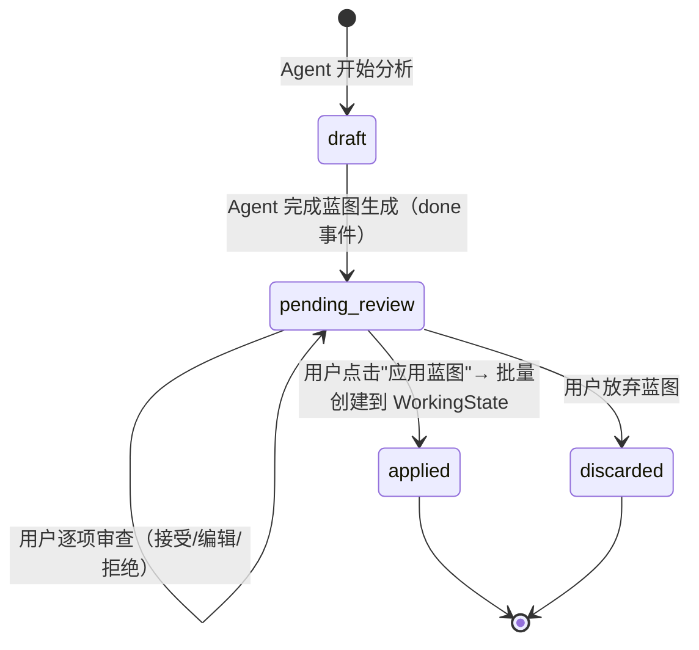
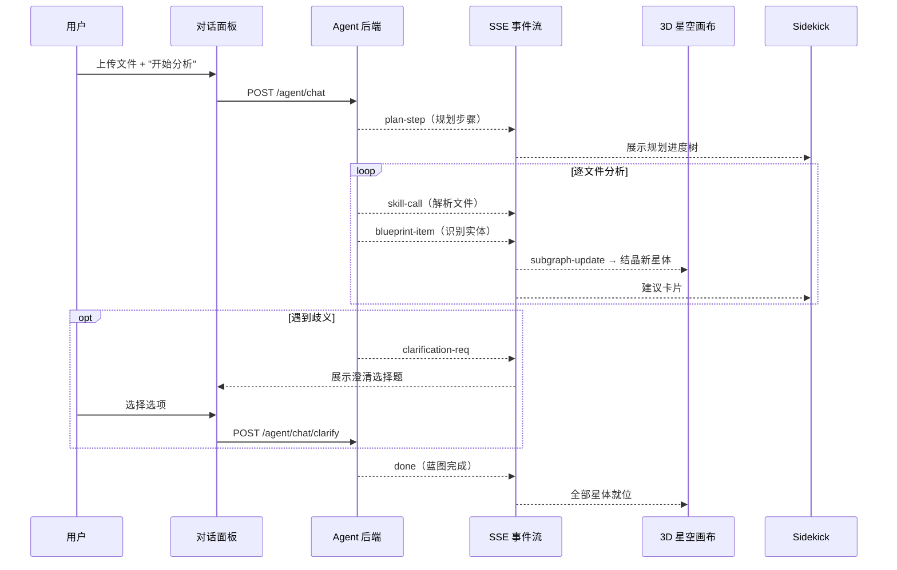
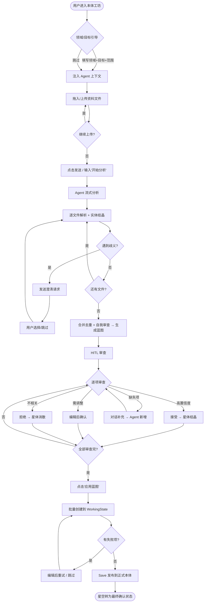

# Open Ontology v0.2.0 — AI 辅助本体构建 PRD

> **版本**: v0.2.0
> **状态**: Draft
> **日期**: 2026-03-24
> **前置版本**: v0.1.0（MVP）— 本体管理平台基础 CRUD

---

## 目录

- [一、背景与愿景](#一背景与愿景) — 痛点回顾、核心愿景、商业价值、用户画像
  - [1.1 v0.1.0 回顾与局限](#11-v010-回顾与局限)
  - [1.2 v0.2.0 核心愿景](#12-v020-核心愿景)
  - [1.3 商业价值](#13-商业价值)
  - [1.4 目标用户画像](#14-目标用户画像)
  - [1.5 与 ontology-agent-framework 的关系](#15-与-ontology-agent-framework-的关系)
- [二、目标及优先级](#二目标及优先级) — P0/P1/P2 功能分级
- [三、核心概念定义](#三核心概念定义) — 本体工坊、Agent、蓝图、HITL、置信度、Skills 等 9 个核心概念
  - [3.1 本体工坊与 Chat-to-Canvas](#31-本体工坊ontology-workshop与-chat-to-canvas-范式)
  - [3.2 本体构建 Agent](#32-本体构建-agent)
  - [3.3 本体蓝图](#33-本体蓝图ontology-blueprint)
  - [3.4 HITL 三级操作模式](#34-hitl-三级操作模式)
  - [3.5 置信度、推理溯源与 AI 提示模式](#35-置信度推理溯源与-ai-提示模式)
  - [3.6 Skills 体系](#36-skills-体系)
  - [3.7 机器体验（MX）与语义设计系统](#37-机器体验mx与语义设计系统)
  - [3.8 引导性提示](#38-引导性提示suggested-prompts)
  - [3.9 实时数据预览](#39-实时数据预览live-data-previews)
- [四、功能需求说明](#四功能需求说明) — 6 个模块的详细功能规格
  - [4.1 模块 A：本体构建 Agent 引擎（P0）](#41-模块-a本体构建-agent-引擎p0)
  - [4.2 模块 B：资料分析与本体蓝图生成（P0）](#42-模块-b资料分析与本体蓝图生成p0)
  - [4.3 模块 C：3D 本体工坊（P0）](#43-模块-c3d-本体工坊p0)
  - [4.4 模块 D：HITL 蓝图审查与微调（P0）](#44-模块-dhitl-蓝图审查与微调p0)
  - [4.5 模块 E：CLI 工具与 Skills 体系（P0）](#45-模块-ecli-工具与-skills-体系p0)
  - [4.6 模块 F：Agent Sidekick 面板（P1）](#46-模块-fagent-sidekick-面板p1)
- [五、用户故事与交互流程](#五用户故事与交互流程) — 5 个核心用户故事 + 端到端流程走查
  - [5.1 核心用户故事](#51-核心用户故事)
  - [5.2 端到端流程走查](#52-端到端流程走查)
  - [5.3 HITL 交互规范](#53-hitl-交互规范)
- [六、技术约束与架构决策](#六技术约束与架构决策) — 集成方案、API、数据库、安全、性能
  - [6.1 deepagents 集成方案](#61-deepagents-集成方案)
  - [6.2 新增 API 端点](#62-新增-api-端点)
  - [6.3 新增数据库表](#63-新增数据库表)
  - [6.4 LLM 模型配置](#64-llm-模型配置)
  - [6.5 安全约束](#65-安全约束)
  - [6.6 LLM 成本控制策略](#66-llm-成本控制策略)
  - [6.7 语义设计系统技术要求](#67-语义设计系统技术要求)
  - [6.8 前端渲染性能策略](#68-前端渲染性能策略)
- [七、非功能性需求](#七非功能性需求) — 性能指标、可观测性、兼容性
- [八、里程碑与交付计划](#八里程碑与交付计划) — 5 阶段交付路线图
- [附录](#附录) — 术语表、v0.1.0 变更对照、外部参考

---

# 一、背景与愿景

## 1.1 v0.1.0 回顾与局限

v0.1.0（MVP）成功复现了 Palantir Ontology Manager 的核心操作能力：

- ✅ 对象类型（Object Type）的创建、编辑、删除
- ✅ 链接类型（Link Type）的创建、编辑、删除
- ✅ 属性（Property）管理与类型映射
- ✅ 数据连接（MySQL 快照导入 / Excel·CSV 上传）
- ✅ 变更管理（Working State 草稿模式）
- ✅ 本体搜索（全文检索）

然而，这些功能本质上是**大模型时代之前的产物**——用户仍然需要手动完成以下繁琐流程：

1. **理解本体概念**：对象类型、属性、链接类型等概念对业务人员陌生
2. **逐个创建实体**：通过 5 步向导逐一创建对象类型，每个对象类型需手动配置属性
3. **手动建立关系**：识别并创建对象类型之间的链接关系需要数据建模经验
4. **反复调整迭代**：初次建模难以一步到位，需要多轮调整

**核心痛点**：对于业务用户而言，想要创建一个适合企业真实场景的本体，仍然**难如登天**。

## 1.2 v0.2.0 核心愿景

> **从"手动逐步创建"到"Agent 辅助批量构建 + 3D 可视化微调"**

大模型与 Agent 技术的发展使得一种全新的本体构建范式成为可能：

```
传统方式（v0.1.0）：
  理解概念 → 准备数据 → 逐个创建对象类型 → 逐个配置属性 → 逐个建立链接 → 反复调整
  ⏱ 数小时到数天

Agent 辅助方式（v0.2.0）：
  上传资料 → Agent 自动分析 → 生成本体蓝图 → 3D 可视化审查 → 微调确认 → 一键发布
  ⏱ 数分钟
```

v0.2.0 的三大核心目标：

| # | 目标 | 衡量标准 |
|---|------|----------|
| 1 | **降低业务用户创建企业本体的门槛** | 无需理解本体建模概念，上传资料即可获得本体初稿 |
| 2 | **最大限度提高 Agent 的本体创建效果** | 使用 deepagents 框架，将原子操作封装为 Skills，Agent 灵活调用 |
| 3 | **极致的用户交互体验** | 3D 星空可视化 + 流式 HITL 交互，让人惊呼"本体构建就应该这么做！" |

## 1.3 商业价值

v0.2.0 标志着本体管理系统从"底层数据治理工具"跃升为"企业业务建模赋能平台"。传统 Ontology Manager 的高配置门槛将最了解企业运作规律的业务专家拒之门外，导致构建出的模型往往"技术上完美但与业务现实脱节"。意图驱动 + Chat-to-Canvas 的新范式通过极大降低技术壁垒，赋能领域专家亲自参与本体构建，将隐性知识快速转化为显性的语义模型。

核心 ROI：
- **Time-to-Value 缩短 10x+**：从"数天手动配置"到"数分钟 Agent 辅助"
- **业务知识保真度提升**：领域专家直接参与，减少"技术翻译"导致的语义损耗
- **企业知识资产积累**：Agent 记忆机制实现跨项目的建模规范传承，越用越好

## 1.4 目标用户画像

| 用户角色 | 典型背景 | 使用场景 | 技术水平 |
|----------|----------|----------|----------|
| **业务分析师** | 了解业务流程，不懂数据建模 | 上传业务文档、Excel 表格，让 Agent 生成初始本体 | 低 |
| **领域专家** | 深谙行业知识，对本体有直觉但不会操作 | 审查 Agent 生成的蓝图，调整实体关系和属性 | 中 |
| **数据架构师** | 精通数据建模，需要快速原型 | 上传 DDL/ERD，快速生成本体骨架后精调 | 高 |
| **开发者** | 使用 CLI/Skills 自动化本体构建流程 | 在 CI/CD 或 Claude Code 中执行批量本体操作 | 高 |

## 1.5 与 ontology-agent-framework 的关系

项目中存在两套定位不同的 Agent 系统：

```
┌──────────────────────────────────────────────────────────────────┐
│                    Open Ontology Agent 生态                       │
├────────────────────────────┬─────────────────────────────────────┤
│  v0.2.0 本体构建 Agent      │  ontology-agent-framework           │
│  (本 PRD)                   │  (未来版本)                          │
│                             │                                     │
│  目的：帮用户从零构建本体    │  目的：基于已有本体构建 Agent 应用   │
│  框架：deepagents            │  框架：LangGraph                    │
│  输入：文档/表格/DDL         │  输入：自然语言查询                  │
│  输出：本体蓝图 → 正式本体   │  输出：结构化回答 + 可视化          │
│                             │                                     │
│  用户：业务分析师/领域专家   │  用户：数据工程师/Agent 开发者      │
│  阶段：本体 = 空 → 本体完成  │  阶段：本体已完成 → 使用本体       │
└────────────────────────────┴─────────────────────────────────────┘
                                        │
                              ┌─────────┴─────────┐
                              │  Ontology Core     │
                              │  (共享的领域模型    │
                              │   和 Service 层)   │
                              └────────────────────┘
```

**v0.2.0 PRD 不包含 ontology-agent-framework 的内容。** 两者共享底层的 Ontology Core（Domain 模型、Service 层、Storage 层），但 Agent 编排层完全独立。

---

# 二、目标及优先级

<table>
<thead>
<tr>
<th>优先级</th>
<th>目标</th>
</tr>
</thead>
<tbody>
<tr>
<td>P0</td>
<td>
<ol>
<li><b>本体构建 Agent 引擎</b> — 基于 deepagents 的通用 Agent，具备自主规划、Skill 调用、子 Agent 派生能力</li>
<li><b>资料分析与本体蓝图生成</b> — 支持上传结构化/非结构化资料，Agent 自动分析并生成本体蓝图</li>
<li><b>3D 本体工坊</b> — 将 3D 星空 Demo 升级为正式的本体可视化工作台，与 Agent 深度联动</li>
<li><b>HITL 蓝图审查与微调</b> — 三级操作（接受/编辑/拒绝），流式可视化审查流程</li>
<li><b>CLI 工具与 Skills 体系</b> — 将原子操作包装为 CLI 命令和 Claude Code Skills，Agent 和开发者共用</li>
</ol>
</td>
</tr>
<tr>
<td>P1</td>
<td>
<ol>
<li><b>Agent Sidekick 面板</b> — Ontology Manager 各页面的常驻 AI 助手侧栏</li>
<li><b>本体导入导出（JSON）</b>（v0.1.0 延后）</li>
<li><b>Agent 反馈学习</b> — 记录用户对建议的接受/拒绝行为，用于优化后续推荐</li>
</ol>
</td>
</tr>
<tr>
<td>P2（本期不做）</td>
<td>
<ol>
<li>多人实时协作本体工坊（WebSocket + CRDT）</li>
<li>非结构化数据一等公民存储（Media Set）</li>
<li>Agent 知识库（向量索引 + 设计模式库）</li>
<li>对象类型复制（v0.1.0 延后）</li>
</ol>
</td>
</tr>
</tbody>
</table>

---

# 三、核心概念定义

> **本章摘要**：v0.2.0 围绕 9 个核心概念构建产品：**本体工坊**（Chat-to-Canvas 主界面）→ **本体构建 Agent**（deepagents 驱动的 AI 引擎）→ **本体蓝图**（Agent 生成的建议中间产物）→ **HITL 三级操作**（接受/编辑/拒绝的审查模式）→ **置信度与 AI 提示模式**（区分事实与建议的视觉体系）→ **Skills 体系**（三层操作封装）→ **机器体验 MX**（语义组件驱动 Agent-UI 协作）→ **引导性提示**（上下文感知的操作建议）→ **实时数据预览**（关系验证探针）。这些概念从交互入口到数据验证形成完整闭环。

## 3.1 本体工坊（Ontology Workshop）与 Chat-to-Canvas 范式

3D 星空 Demo 升级后的正式产品名称。本体工坊是 v0.2.0 的**主交互界面**，取代传统的表格/表单 CRUD 模式，成为用户构建和审查本体的核心工作空间。

本体工坊的核心交互范式为 **Chat-to-Canvas**——融合对话界面的"意图表达效率"与画布界面的"空间拓扑感知"，实现空间与时间的认知融合：

- **时间维度（Chat）**：左侧对话面板承载线性的意图表达和多轮对话
- **空间维度（Canvas）**：中央 3D 星空画布承载非线性的拓扑结构和全局视野

传统的对话式界面（CUI）虽然降低了输入门槛，但其固有的线性时间流无法展示复杂图谱结构。传统的表单驱动 GUI 又强迫用户陷入底层字段映射。Chat-to-Canvas 完美解决了这个矛盾——用户在对话中表达意图，在画布中看到全貌，实现**从"所见即所得"到"所想即所得"**的跨越。

画布本质上是**动态生成式 UI（Generative UI）**——不是静态的图片渲染，而是由一个个可交互的 React 组件或 WebGL 节点构成的活体模型。每个对象节点清晰展示标题键、核心属性、数据源健康度及关联链路，Agent 的每次推理都能在画布上实时生成新的可交互组件。

```
┌──────────────────────────────────────────────────────────────┐
│                      本体工坊布局                              │
├──────────┬───────────────────────────────────┬───────────────┤
│          │                                   │               │
│  对话    │                                   │   Agent       │
│  面板    │      3D 星空画布                   │   Sidekick    │
│  (Chat)  │   （对象类型 = 星体）              │   (建议面板)  │
│          │   （链接类型 = 星链）              │               │
│          │   （属性 = 星体光圈细节）          │   · 推荐建议  │
│  · 上传  │                                   │   · 置信度    │
│  · 对话  │      工具栏                        │   · 推理链    │
│  · 历史  │   缩放|适配|重置|2D/3D|模式切换    │   · 操作按钮  │
│          │                                   │               │
├──────────┴───────────────────────────────────┴───────────────┤
│   蓝图审查栏（可折叠）— 表格式展示所有建议项，支持批量操作     │
└──────────────────────────────────────────────────────────────┘
```

**关键设计原则**：
- 3D 星空是主视图，ReactFlow 2D 作为备选（节点 > 200 时自动降级，或用户手动切换）
- 左侧对话面板支持用户上传资料和与 Agent 自然语言交互
- 右侧 Sidekick 面板展示 Agent 的实时建议和推理过程
- 底部蓝图审查栏提供表格式的精确编辑能力

## 3.2 本体构建 Agent

基于 deepagents 框架驱动的通用 AI Agent，具备以下核心能力：

| 能力 | deepagents 对应机制 | 说明 |
|------|---------------------|------|
| **自主规划** | Planning Tool（`write_todos`） | Agent 接收用户上传的资料后，自动拆解为分析步骤 |
| **Skill 调用** | Skill System（SKILL.md 目录） | 按需加载本体操作 Skills（创建对象类型、添加属性等） |
| **子 Agent 派生** | Subagent Spawning | 复杂任务拆分给子 Agent 并行处理（如同时分析多个文件） |
| **上下文管理** | Context Management | 管理大文件分析的上下文窗口，防止溢出 |
| **长期记忆** | Memory Persistence | 记录用户偏好和历史决策，优化后续推荐 |

## 3.3 本体蓝图（Ontology Blueprint）

Agent 分析资料后生成的本体初稿，是用户审查和微调的中间产物。蓝图不是正式本体——它是一组"建议"，需要经过用户 HITL 审查后才转化为 WorkingState 中的草稿。

### 蓝图生命周期



### 蓝图数据结构

**Blueprint 顶层字段**：

| 字段 | 类型 | 说明 |
|------|------|------|
| `blueprintRid` | string | 蓝图唯一标识（`ri.ontology.blueprint.<uuid>`） |
| `name` | string | 蓝图名称（如"电商平台本体蓝图"） |
| `status` | enum | `draft` / `pending_review` / `applied` / `discarded` |
| `sourceFiles` | string[] | 来源文件列表 |
| `items` | BlueprintItem[] | 蓝图项列表 |

**BlueprintItem 字段**：

| 字段 | 类型 | 说明 |
|------|------|------|
| `itemRid` | string | 蓝图项唯一标识 |
| `type` | enum | `object_type` / `property` / `link_type` |
| `suggestion` | object | 建议内容（对象类型/属性/链接的完整定义） |
| `confidence` | float | 置信度分值（0.0–1.0） |
| `confidenceLevel` | enum | `high`（≥0.8）/ `medium`（0.5–0.8）/ `low`（<0.5） |
| `reasoning` | string | 推理说明 |
| `source` | enum | `field_analysis` / `pattern_matching` / `semantic_inference` / `best_practices` |
| `userDecision` | enum? | `null`（未审查）/ `accepted` / `edited` / `rejected` |

**示例**（对象类型蓝图项）：

```json
{
  "itemRid": "ri.ontology.blueprint-item.001",
  "type": "object_type",
  "suggestion": {
    "displayName": "订单", "apiName": "Order",
    "description": "表示一次客户购买行为",
    "properties": [
      { "displayName": "订单编号", "apiName": "orderId", "baseType": "string", "isPrimaryKey": true },
      { "displayName": "金额", "apiName": "amount", "baseType": "double" }
    ]
  },
  "confidence": 0.92, "confidenceLevel": "high",
  "reasoning": "从 orders.csv 的列结构直接推断",
  "source": "field_analysis", "userDecision": null
}
```

## 3.4 HITL 三级操作模式

v0.2.0 的 Human-in-the-Loop 设计遵循"接受/编辑/拒绝"三级模式，而非传统的二元"接受/拒绝"：

| 操作 | 触发 | 用户交互 | 3D 效果 |
|------|------|----------|---------|
| **接受（Accept）** | 点击 ✓ 或自动（高置信度项） | 一键操作 | 星体从半透明"结晶"为实体，伴随发光脉冲 |
| **编辑（Edit）** | 点击 ⚙️ 展开详情 | 内联编辑属性/类型/关系 | 星体闪烁等待状态，编辑确认后结晶 |
| **拒绝（Reject）** | 点击 ✗，可选填理由 | 一键操作，可附理由 | 星体碎裂消散动画 |

**风险分级**：

| 风险级 | 操作类型 | Agent 行为 | 用户交互 |
|--------|----------|------------|----------|
| 🟢 低 | 读取/分析 | 自动执行 | 仅在 Sidekick 展示进度 |
| 🟡 中 | 创建新实体（进入草稿） | 展示建议，等待确认 | 三级操作模式 |
| 🔴 高 | 修改/删除已有实体 | 展示影响范围，等待确认 | 二次确认弹窗 + 影响范围分析 |

## 3.5 置信度、推理溯源与 AI 提示模式

### AI 提示模式（AI Notice Pattern）

系统必须诚实且清晰地区分"用户已确认的物理结构"与"AI 推理出的逻辑结构"。这是贯穿全局的设计原则：

| 元素状态 | 视觉表达 | 交互行为 |
|----------|----------|----------|
| **用户已确认** | 实线连线、实体星体、明亮稳定 | 直接编辑 |
| **AI 建议（待审）** | 带流动光效的虚线、半透明星体、中心悬浮发光 AI 角标 ✦ | 悬停展示推理依据 + 置信度；点击进入三级操作 |
| **AI 低置信度** | 微弱闪烁、虚线 + 警示色 | 悬停展示"需专家确认"提示 |

所有 AI 生成的元素（蓝图项、建议链接、推断属性）都必须携带 AI 角标，确保用户始终能区分"事实"与"建议"。这种设计让 AI 始终是"高效的建议者"而非"盲目的决策者"，用户占据系统的控制制高点。

### 置信度分级

每条 Agent 建议都附带透明的质量评估：

| 置信度 | 标签 | 视觉 | 含义 |
|--------|------|------|------|
| ≥ 0.8 | 🟢 高置信度 | 星体明亮，连线实线 | 基于明确的字段/结构分析 |
| 0.5–0.8 | 🟡 中置信度 | 星体半透明，连线虚线 | 基于模式匹配或名称推断 |
| < 0.5 | 🔴 低置信度 | 星体微弱闪烁 | 基于启发式猜测，需专家确认 |

**推理来源标签**：

| 来源 | 说明 | 示例 |
|------|------|------|
| `field_analysis` | 直接从字段名/类型推断 | "CSV 列 `order_id` (string) → 属性 orderId" |
| `pattern_matching` | 外键模式/命名模式匹配 | "列 `customer_id` 匹配 Customer 表主键模式" |
| `semantic_inference` | LLM 语义理解（非结构化文档） | "PDF 中提到'每个客户可下多个订单' → 1:N 关系" |
| `best_practices` | 参考行业通用本体模式 | "电商领域 Order-Product 通常为 N:N 关系" |

## 3.6 Skills 体系

将本体操作封装为标准化的 Skills，供 Agent 内部调用和开发者外部使用：

```
本体操作 Skills 分层：

┌─────────────────────────────────────────────────┐
│  Level 3: 编排级 Skill（Agent 自主调用）          │
│  · analyze-materials   — 分析资料生成蓝图        │
│  · generate-blueprint  — 综合多文件生成完整蓝图   │
│  · optimize-ontology   — 分析现有本体提优化建议   │
└──────────────────────┬──────────────────────────┘
                       │ 调用
┌──────────────────────┴──────────────────────────┐
│  Level 2: 组合级 Skill                           │
│  · create-object-type-with-properties            │
│  · create-link-type-with-validation              │
│  · batch-create-from-blueprint                   │
└──────────────────────┬──────────────────────────┘
                       │ 调用
┌──────────────────────┴──────────────────────────┐
│  Level 1: 原子级 Skill（CLI 命令直接对应）        │
│  · create-object-type  · update-object-type      │
│  · delete-object-type  · create-property         │
│  · create-link-type    · update-link-type        │
│  · import-dataset      · list-object-types       │
│  · search-ontology     · validate-ontology       │
└─────────────────────────────────────────────────┘
```

## 3.7 机器体验（MX）与语义设计系统

为了支撑 Chat-to-Canvas 中 Agent 对 UI 的精确驱动，v0.2.0 不仅为人类用户设计用户体验（UX），还需为 Agent 设计**机器体验（Machine Experience, MX）**。

底层组件库需从"纯视觉组件"升级为"语义组件"：

| 语义设计系统要素 | 实现机制 | 对 Agent 的增益 |
|-----------------|----------|----------------|
| **组件文档元数据** | 每个 UI 组件（属性编辑器卡片、关联连线等）注入描述性元数据 | Agent 能精确理解自然语言修改指令应映射到哪个组件 |
| **语义化设计令牌** | 采用意图描述（如 `link-primary-foreign-key`）而非纯视觉定义（如 `color-blue`） | Agent 能理解视觉呈现背后的业务逻辑与数据流动方向 |
| **组件关系映射** | 显式定义组件间逻辑绑定关系（如对象卡片与属性列表的嵌套从属） | Agent 可通过生成指令准确驱动多层级 UI 状态变更 |

这使得当用户在画布上框选两个实体并在对话框中输入"建立一对多关系"时，Agent 能在视觉层绘制动态连线，并在底层同步触发数据结构变更。

## 3.8 引导性提示（Suggested Prompts）

为降低非技术用户面对空白对话框时的"冷启动"焦虑，系统根据画布焦点**动态渲染引导性提示气泡**。

当用户在画布上选中某个实体但不知如何操作时，对话面板上方弹出上下文相关的建议气泡：

```
选中"员工档案"对象类型后：

  💡 "拆分敏感字段以提高安全性"
  💡 "检查是否存在孤立的外键"
  💡 "根据薪酬等级推导统计属性"
```

用户点击气泡即可驱动 Agent 执行对应操作。这种设计不仅降低操作门槛，还在潜移默化中向用户普及本体建模最佳实践。

## 3.9 实时数据预览（Live Data Previews）

建立关系后，用户可触发"数据验证探针"——系统从真实后端数据源抽取小批量脱敏样本，灌注到画布上的实体卡片中，执行模拟 Join 验证关系正确性。

- 如果关联逻辑正确，卡片中展示匹配的真实记录样本
- 如果外键匹配失败或产生空集，卡片以红标亮起并提示用户重审

这使得逻辑错误在建模阶段就被扼杀在摇篮中，提供无可匹敌的安全感与掌控感。

---

# 四、功能需求说明

> **本章摘要**：v0.2.0 由 6 个功能模块构成，按数据流形成主干链路 A→B→C→D，辅以 E（CLI/Skills）和 F（Sidekick）作为独立入口。

```
模块协作全景：

   用户上传资料 / 自然语言指令
           │
           ▼
  ┌─────────────────────┐
  │  A. Agent 引擎 (P0)  │◄──── E. CLI / Skills (P0)
  │  规划 + Skill 调用    │      （开发者 & CI/CD 入口）
  └────────┬────────────┘
           │ SSE 流式事件
           ▼
  ┌─────────────────────┐
  │  B. 资料分析 &       │
  │     蓝图生成 (P0)    │
  └────────┬────────────┘
           │ blueprint-item / subgraph-update
           ▼
  ┌─────────────────────┐      ┌─────────────────────┐
  │  C. 3D 本体工坊 (P0) │◄────►│  D. HITL 审查 (P0)   │
  │  星空可视化 + 交互    │      │  蓝图审查 + 应用      │
  └─────────────────────┘      └────────┬────────────┘
                                         │ 批量创建
                                         ▼
                                WorkingState（草稿）→ Save 发布

                    F. Sidekick (P1) — Ontology Manager 各页面的轻量级 AI 助手
```

## 4.1 模块 A：本体构建 Agent 引擎（P0）

### 概述

基于 deepagents 框架构建的通用 Agent，是 v0.2.0 的核心引擎。Agent 接收用户上传的资料或自然语言指令，自主规划分析步骤，调用 Skills 完成本体蓝图的生成。

### 核心能力

#### A1. 自主规划（Planning）

Agent 接收任务后，自动将复杂目标拆解为可执行步骤：

```
用户上传 3 个文件：orders.csv, products.xlsx, 业务流程说明.pdf

Agent 规划：
  Step 1: 解析 orders.csv 结构 → 提取列名、类型、样本数据
  Step 2: 解析 products.xlsx 结构 → 提取列名、类型、样本数据
  Step 3: 分析"业务流程说明.pdf" → 用 LLM 提取实体、关系、业务规则
  Step 4: 交叉对比三个文件，识别共同实体和外键关系
  Step 5: 生成本体蓝图初稿
  Step 6: 对蓝图进行自我审查（命名冲突、循环链接、缺失属性）
  Step 7: 输出最终蓝图，等待用户 HITL 审查
```

规划过程以**动态思维导图**的形式实时展示在 Agent Sidekick 面板中——以任务树形式呈现各个并行计算分支及当前进度（如 "语义解析中"、"链接推演中"），用户可在任一阶段点击"暂停执行"进入局部人工干预模式。

#### A2. Skill 系统

deepagents 的 Skill 系统采用**两层加载**机制：

1. **快速初始化**：仅加载 Skill 描述（几十字节），全部 Skills 的描述同时存在于 Agent 上下文中
2. **按需详细化**：Agent 判断需要某 Skill 时，加载完整 SKILL.md（含参数定义、使用示例、约束规则）

这种机制避免了将所有 Skill 定义一次性塞入上下文导致的 token 浪费。

#### A3. 子 Agent 派生

当用户上传多个文件时，Agent 可以派生子 Agent 并行处理：

```
主 Agent
  ├── 子 Agent 1: 分析 orders.csv → 提取 Order 对象类型
  ├── 子 Agent 2: 分析 products.xlsx → 提取 Product 对象类型
  └── 子 Agent 3: 分析 业务流程说明.pdf → 提取业务实体和关系
      │
      └── 主 Agent 汇总三个子 Agent 的结果 → 合并去重 → 生成完整蓝图
```

子 Agent 拥有独立的上下文窗口，避免大文件分析相互干扰。

#### A4. 对话交互

用户可以在对话面板中与 Agent 自然语言交互：

- "帮我分析这些文件，生成一个电商平台的本体"
- "Order 和 Customer 之间应该是什么关系？"
- "把 Shipping 对象类型的名称改成 Delivery"
- "这个蓝图里缺少了退货相关的对象类型，请补充"

Agent 的回复以 **SSE 流式** 方式逐步输出，同时通过事件触发 3D 星空和 Sidekick 面板的联动更新。

#### A4a. 主动澄清机制（Proactive Clarification）

Agent 在分析过程中遇到歧义时，**不猜测，而是主动暂停分析并向用户提问**。这是 HITL 的关键补充——除了"审查建议"之外，还有"回答澄清"。

**触发场景**：

| 歧义类型 | 示例 | Agent 行为 |
|----------|------|------------|
| **实体定义模糊** | "客户"在不同文件中可能指个人消费者或企业客户 | 抛出选择题："'客户'在您的业务中是指个人消费者还是企业客户？" |
| **多候选主键** | 一张表中有 `id`、`code`、`serial_number` 三个唯一列 | 展示候选列及其数据分布，请用户选择主键 |
| **关系方向不确定** | "部门"与"员工"的从属关系无法从列名推断 | 请用户确认：一个部门包含多个员工（1:N）还是员工可属于多个部门（N:M）？ |
| **命名冲突** | 多个文件中出现同名但结构不同的实体 | 请用户确认是同一实体（合并）还是不同实体（分别命名） |
| **领域术语歧义** | 行业术语有多种解读方式 | 提供 2-3 种可能解读供用户选择 |

**交互形式**：

澄清请求以**结构化选择题**形式出现在对话面板中（而非开放式提问），降低用户回答成本：

```
┌──────────────────────────────────────────────────┐
│ 🤔 需要您的确认                                    │
│                                                    │
│ 在 orders.csv 和 crm_data.xlsx 中都出现了"客户"    │
│ 但字段结构不同：                                   │
│ · orders.csv: customer_name, phone               │
│ · crm_data.xlsx: company_name, contact_person    │
│                                                    │
│ 请选择：                                           │
│ ○ 这是同一实体（合并为 Customer，包含所有字段）     │
│ ○ 这是两种不同客户（个人客户 + 企业客户）           │
│ ○ 让我补充说明：[_______________]                  │
│                                                    │
│                               [跳过，Agent 自行判断] │
└──────────────────────────────────────────────────┘
```

用户也可点击"跳过"，Agent 将基于最高置信度的选项继续，但会在蓝图中将该项标记为"未经用户确认"（降低置信度）。

#### A5. 上下文管理与虚拟文件系统

大模型的上下文窗口不仅是昂贵的计算资源，更是维持高专注度推理的边界。deepagents 通过**虚拟文件系统中间件**彻底解决上下文溢出问题：

1. **数据外部化存储**：子 Agent 完成数据提取后，通过 `write_file` 将中间态数据（如包含上千属性的暂存 JSON）写入虚拟磁盘，清空激活上下文
2. **按需读取与精准检索**：后续推演阶段，Agent 通过 `ls`（列目录）、`grep`（正则搜索）、`read_file` 精准提取所需数据，保持工作记忆的纯净度
3. **记忆压缩**：当会话 Token 消耗逼近阈值时，自动触发 `compact_conversation` 工具，对历史对话进行高浓度语义总结，将原始冗长轮次归档到持久化存储，释放上下文空间

Agent 还需理解当前本体的已有状态。通过 `03-agent-context-architecture.md` 定义的三接口策略获取本体上下文：

- **小型本体**（< 50 个对象类型）：完整 Schema 内联到 system prompt
- **大型本体**：L0 摘要 + 按需加载 L2 详情

#### A6. 企业资产增量记忆刻录

系统捕获并提炼用户在交互过程中的独特架构偏好与领域规律，持久化写入全局知识库（`.deepagents/AGENTS.md`）：

- **跨项目组织级知识累积**：如 "在我们的业务语境中，'发货单'不应作为独立对象，而应作为'订单'的嵌套属性"
- **偏好自动调取**：后续导入新数据时，Agent 自动遵循前期确立的建模规范
- **引用声明**：Agent 推理时主动向用户声明"引用了某项组织规范"，保持透明度

这实现了真正的企业级定制化能力传承——Agent 不仅学会了当前项目的规范，还能在未来项目中复用这些知识。

### SSE 流式事件协议

Agent 与前端通过 SSE 流式通信，事件类型如下：

```
event: plan-step         # Agent 规划步骤（data: { step, index, total }）
event: text-delta        # 文本增量（data: { text }）
event: skill-call        # Skill 调用通知（data: { skillName, params, status }）
event: blueprint-item    # 蓝图项建议（data: { item: BlueprintItem }）
event: subgraph-update   # 3D 星空子图更新（data: { nodes, edges, action }）
event: confidence-update # 置信度更新（data: { itemRid, confidence, reasoning }）
event: clarification-req # 澄清请求（data: { questionId, question, options[], context }）
event: done              # 流结束（data: { blueprintRid, summary }）
event: error             # 错误（data: { code, message }）
```

### SSE 连接恢复策略

流式分析过程中网络可能中断，需要明确的恢复机制：

| 场景 | 前端行为 | 后端行为 |
|------|----------|----------|
| **网络短暂断开（< 30s）** | 指数退避自动重连（1s → 2s → 4s → 8s，最大 30s） | 维持分析进程，缓冲期间产生的事件 |
| **网络长时间断开（> 30s）** | 显示"连接已断开"横幅 + 手动重连按钮 | 分析继续执行，事件持久化到数据库 |
| **重连成功** | 携带 `Last-Event-ID` 请求断点续传 | 从断点发送缓冲/持久化的事件 |
| **分析已完成** | 重连后直接获取完整蓝图 | 返回 `done` 事件 + 完整蓝图 |

关键实现要求：
- 每个 SSE 事件携带递增 `id` 字段，支持 `Last-Event-ID` 断点续传
- 服务端分析进度独立于 SSE 连接存在（分析不因连接断开而中止）
- 前端在重连期间以 loading spinner 覆盖画布，恢复后批量重放缓冲事件

### 对话会话管理

- 每次进入本体工坊创建一个会话（Session）
- 会话包含完整的消息历史和关联的蓝图
- 用户可以查看历史会话、继续未完成的蓝图审查
- 会话数据持久化到数据库
- **并发约束**：单用户同一时间仅允许一个活跃分析会话（即 Agent 正在执行分析的会话）；可同时存在多个历史会话供浏览和继续审查

---

## 4.2 模块 B：资料分析与本体蓝图生成（P0）

### 概述

支持用户上传结构化和非结构化资料，由 Agent 自动分析并生成本体蓝图。

### 支持的资料类型

| 类型 | 格式 | 分析方式 | 产出 |
|------|------|----------|------|
| **结构化** | CSV, Excel (.xlsx) | 直接解析列名、数据类型、样本数据 | 对象类型 + 属性 |
| **结构化** | SQL DDL | 解析表定义、主外键关系、索引 | 对象类型 + 属性 + 链接类型 |
| **结构化** | JSON Schema | 解析对象结构和嵌套关系 | 对象类型 + 属性 + 链接类型 |
| **非结构化** | PDF, Markdown, Word | LLM 提取实体、关系、业务规则 | 对象类型 + 链接类型 + 描述 |
| **非结构化** | 纯文本（自然语言描述） | LLM 语义分析 | 对象类型 + 链接类型 |

### 上传与分析流程

```
Phase 0: 领域与目标引导
━━━━━━━━━━━━━━━━━━━━━━━
在 Agent 开始分析之前，系统引导用户明确业务上下文，以提高蓝图质量：

  → 用户进入本体工坊后，对话面板展示结构化引导卡片：

  ┌────────────────────────────────────────────────────┐
  │ 🎯 开始构建本体                                     │
  │                                                      │
  │ 业务领域（可选，帮助 Agent 理解行业术语）：            │
  │ [电商零售] [金融银行] [供应链物流] [医疗健康]          │
  │ [制造业] [人力资源] [其他: ___________]               │
  │                                                      │
  │ 建模目标（可选，影响本体结构侧重）：                   │
  │ [数据整合与搜索] [决策分析与报表] [知识图谱探索]       │
  │ [AI 应用基座] [数据治理合规] [其他: ___________]      │
  │                                                      │
  │ 关键概念范围（可选，缩小分析边界）：                   │
  │ [_______________________________________________]    │
  │ 例如："聚焦订单履约流程，不含财务对账"                 │
  │                                                      │
  │       [跳过，直接上传资料]  [确认并继续]              │
  └────────────────────────────────────────────────────┘

  → 用户可跳过引导直接上传资料（Agent 从资料内容自行推断领域）
  → 已填写的领域/目标信息注入 Agent 系统提示，显著提升分析精准度
  → 领域信息同时存入会话元数据，用于后续引导性提示的上下文感知

Phase 1: 资料上传
━━━━━━━━━━━━━━━━━
用户在对话面板中拖入文件（或点击上传按钮）
  → 文件上传到服务端临时存储
  → 前端显示文件缩略图和基本信息（名称、大小、类型）
  → 用户可继续上传更多文件，或输入补充说明
  → 用户点击"开始分析"或发送"帮我分析这些文件"

约束：
  · 单文件上限：10 MB
  · 批量上传上限：20 个文件
  · 支持的 MIME 类型白名单校验

异常处理：
  · 文件类型不支持 → 上传拒绝，提示支持的格式列表
  · 文件超过大小限制 → 上传拒绝，提示压缩或拆分文件
  · CSV 编码错误（非 UTF-8/GBK） → 提示用户选择编码或上传 UTF-8 版本
  · Excel 密码保护 → 提示用户解除保护后重新上传
  · PDF 扫描件（纯图片） → 提示"仅支持可选择文本的 PDF，不支持扫描件"
  · 文件内容为空 → 上传成功但标记为"空文件·已跳过"，不参与分析
  · 文件解析超时（> 60s） → 标记该文件为"解析失败"，Agent 跳过继续分析其他文件
  · 所有文件均解析失败 → 终止分析，展示失败原因汇总

Phase 2: Agent 流式分析
━━━━━━━━━━━━━━━━━━━━━━
Agent 接收文件列表 + 用户补充说明 + 领域/目标上下文（来自 Phase 0）
  → 生成分析计划（plan-step 事件）
  → 逐文件/逐步骤分析（skill-call + text-delta 事件）
  → 每识别一个实体/关系，立即发送 blueprint-item 事件
  → 识别结果实时在 3D 星空中"结晶"（subgraph-update 事件）
  → 遇到歧义时发送 clarification-request 事件，暂停等待用户回答（详见 §4.1 A4a）

分析策略：
  · 结构化文件：直接解析 schema → 高置信度建议
  · 非结构化文件：LLM 多轮提取 → 中/低置信度建议
  · 多文件交叉：检测跨文件的实体引用和外键关系
  · 大文件分块：超过 token 限制的文件自动分块处理
  · 主动澄清：遇到实体歧义/关系方向不确定时暂停请求用户确认

Phase 3: 蓝图生成
━━━━━━━━━━━━━━━━
Agent 汇总所有分析结果
  → 合并重复实体（如多个文件都提到 Customer）
  → 补充缺失关系（基于语义推断）
  → 自我审查（命名冲突、循环链接、属性类型一致性）
  → 输出完整蓝图（done 事件）
  → 蓝图持久化到数据库，进入 HITL 审查阶段
```

### 结构化文件分析规则

#### CSV / Excel

- 扫描前 1000 行推断数据类型
- 类型匹配率 > 95% 确认类型，否则默认 String
- 类型映射规则（复用 v0.1.0）：

| 推断类型 | 本体属性类型 |
|----------|-------------|
| 整数 | Integer |
| 小数 | Double |
| 日期格式 | Date |
| 日期时间格式 | Timestamp |
| true/false/0/1 | Boolean |
| 其他 | String |

- 首列或名含 `id`/`_id`/`Id` 的列自动标记为主键候选
- 列名含 `name`/`title`/`label` 的列自动标记为标题键候选
- **审计字段自动剔除**：列名匹配 `created_at`/`updated_at`/`created_by`/`updated_by`/`deleted_at`/`is_deleted` 等技术性审计字段，自动从属性列表中排除（在蓝图中标记为"已跳过·审计字段"，用户可手动恢复）

#### SQL DDL

- 解析 `CREATE TABLE` 语句提取表名、列名、类型
- `PRIMARY KEY` → 主键属性
- `FOREIGN KEY` → 链接类型（自动推断基数关系）
- `UNIQUE INDEX` → 唯一约束属性
- `NOT NULL` → 必填属性

#### 非结构化文件（PDF/Markdown/Word）

Agent 使用 LLM 提取以下信息：

1. **实体识别**：文档中提到的业务实体（人、组织、事件、物品等）
2. **关系识别**：实体之间的关系描述（"客户下单"→ Customer places Order）
3. **属性识别**：实体的特征描述（"订单包含金额和日期"→ amount, date 属性）
4. **业务规则**：影响本体设计的约束（"一个客户可以有多个订单"→ 1:N 基数）

---

## 4.3 模块 C：3D 本体工坊（P0）

### 概述

将 3D 星空 Demo 从独立的演示页面升级为正式的本体可视化工作台，与 Agent 引擎深度联动。

### 工坊页面状态

| 状态 | 条件 | 画布展示 | 对话面板展示 |
|------|------|----------|------------|
| **空白工坊** | 首次进入，无本体数据 | 空星空 + 中心引导动画 | 领域/目标引导卡片（Phase 0） |
| **已有本体** | 存在已发布的对象类型 | 渲染现有对象类型为星体 | "上传资料扩展本体"引导 |
| **分析进行中** | Agent 正在流式分析 | 实时结晶动画 | SSE 流式输出 + 进度步骤 |
| **蓝图待审** | 分析完成，蓝图 `pending_review` | 半透明建议星体 | 审查引导 + 建议摘要 |
| **蓝图已应用** | 所有项已审查并应用 | 实体星体（明亮稳定） | 历史对话 + "继续优化"引导 |
| **连接断开** | SSE 连接中断 | Loading spinner 覆盖 | "连接已断开"横幅 + 重连按钮 |

### 从 Demo 到产品的升级点

| 方面 | Demo（v0.1.0） | 本体工坊（v0.2.0） |
|------|----------------|---------------------|
| 路由 | `/demo/canvas`（独立演示） | `/workshop`（主入口之一） |
| 数据 | Mock 数据 | 真实本体数据（API 驱动） |
| Agent 联动 | Mock 建议（硬编码） | 真实 Agent 推理（SSE 流式） |
| 交互模式 | 手动拖拽创建 | Agent 辅助 + 手动微调 |
| 蓝图审查 | 无 | 底部审查栏 + 内联编辑 |
| 会话持久化 | 无 | 数据库持久化 |
| 视图切换 | 仅 3D | 3D/2D 自由切换 |

### 3D 星空与 Agent 联动

Agent 与画布通过 SSE 事件流实现实时联动，核心消息流如下：



#### 实时结晶动画

Agent 识别新实体时，3D 星空中实时"结晶"出新星体：

```
Agent 发送 blueprint-item 事件（type: object_type）
  → 星空中心产生能量漩涡（VortexEffect 复用）
  → 漩涡中凝聚出新星体（birth animation）
  → 星体半透明状态（pending review）
  → 属性以光圈形式环绕星体
  → Sidekick 面板同步显示建议卡片

Agent 发送 blueprint-item 事件（type: link_type）
  → 两个相关星体之间出现虚线（pending review）
  → 虚线带有方向箭头和基数标注
  → 点击虚线可查看关系详情
```

#### 用户操作驱动 Agent

```
用户在 3D 中点击星体
  → 右侧显示实体详情（Tier 2 面板）
  → 可直接编辑属性/描述
  → Sidekick 显示针对该实体的优化建议

用户在 3D 中拖拽连线
  → 触发链接创建（复用已有 DragLinkLine 组件）
  → Agent 自动推荐基数关系和关系名称

用户在 3D 中删除星体
  → 红色碎裂消散动画
  → Agent 检查并提示可能受影响的链接类型
```

#### 双向高亮联动与焦点锁定

- **对话 → 星空**：Agent 回复中提及的实体名称高亮，悬停时对应星体发光
- **星空 → 对话**：点击星体时，对话面板高亮该实体的历史提及
- 通过 Zustand store（`highlightedEntityRids`）实现共享状态

**焦点锁定机制**：当用户点击画布上的某个星体时，对话框的上下文焦点自动锁定至该实体。此后用户发出的任何自然语言指令（例如："将这些冗长字段缩减为三个核心指标"）都将被精确地仅作用于当前聚焦的对象上。修改完成后，组件状态在画布上流式更新。焦点锁定状态在对话面板顶部以实体标签形式展示，用户可点击取消锁定。

#### 引导性提示气泡

当用户在画布上选中某个实体但犹豫不知如何操作时，系统结合当前焦点动态渲染 3-5 个上下文相关的建议气泡在对话面板上方（详见 §3.8）。点击气泡即可驱动 Agent 执行对应操作。

#### 实时数据预览探针

建立关系后，用户可在星链上触发"数据验证探针"（详见 §3.9）：
- 系统沿逻辑链路潜入后端数据源，抽取小批量脱敏样本执行模拟 Join
- 验证结果直接浮现在实体卡片和连线上
- 匹配成功：连线变为实线，卡片展示匹配记录样本
- 匹配失败：连线红色闪烁，卡片显示空集或不匹配提示

### 3D / 2D 视图切换

- 默认展示 3D 星空视图
- 工具栏提供 3D ⇄ 2D 切换按钮
- 2D 视图使用 ReactFlow 力导向图（`@xyflow/react` 已在依赖中）
- 两个视图共享同一数据源（Zustand store）和交互状态
- 自动降级规则：当实体数 > 200 时，提示用户切换到 2D 以保持流畅

### 渐进式实体探索（三层）

| 层级 | 触发 | 组件 | 内容 |
|------|------|------|------|
| **Tier 1** 悬停预览 | 鼠标悬停 200ms | Popover | 名称 + 类型徽标 + 一行描述 + 置信度 |
| **Tier 2** 侧面板 | 单击实体 | Drawer | 完整属性列表 + 关系分组 + 推理来源 + 操作按钮 |
| **Tier 3** 全屏详情 | 双击或"展开" | 跳转到 Ontology Manager 详情页 | 完整编辑、历史、审计 |

### 中期升级项（从 Demo TODO 中继承，v0.2.0 实施）

以下是 `apps/web/src/pages/demo/TODO-design-upgrades.md` 中的待办项，在 v0.2.0 中落地：

1. ✅ Fresnel 边缘光 + 顶点噪声（星体视觉效果提升）
2. ✅ 拖拽线流光效果 + 能量粒子（链接创建动画）
3. ✅ 链接建立时的冲击波（震撼的视觉反馈）
4. ✅ 电影感相机过渡（场景切换动画）
5. 📋 语义重力场（V1 考虑）
6. 📋 重力书写（V1 考虑）
7. ✅ 手动模式入场氛围

---

## 4.4 模块 D：HITL 蓝图审查与微调（P0）

### 概述

蓝图生成后，用户通过 HITL 交互审查并微调每一项建议，最终将确认的部分批量创建为 WorkingState 中的草稿。交互模式遵循 §3.4 定义的三级操作（接受/编辑/拒绝）和风险分级原则，本节聚焦具体的 UI 组件和功能细节。

### 蓝图审查表格

底部蓝图审查栏以表格形式展示所有建议项：

```
┌──────────────────────────────────────────────────────────────────────┐
│ 蓝图审查 — 电商平台本体                        [全部接受] [应用蓝图] │
├──────┬──────────┬──────┬────────┬────────┬───────────────────────────┤
│ 类型 │ 名称      │ 属性数│ 置信度 │ 来源    │ 操作                     │
├──────┼──────────┼──────┼────────┼────────┼───────────────────────────┤
│ 🔵OT │ Order     │ 8    │ 🟢 92% │ 字段分析│ [✓ 接受] [⚙️ 编辑] [✗ 拒绝]│
│ 🔵OT │ Product   │ 5    │ 🟢 88% │ 字段分析│ [✓ 接受] [⚙️ 编辑] [✗ 拒绝]│
│ 🔵OT │ Customer  │ 7    │ 🟡 72% │ 模式匹配│ [✓ 接受] [⚙️ 编辑] [✗ 拒绝]│
│ 🔗LT │ 包含      │ —    │ 🟡 78% │ 模式匹配│ [✓ 接受] [⚙️ 编辑] [✗ 拒绝]│
│ 🔵OT │ Shipping  │ 4    │ 🟡 65% │ 语义推断│ [✓ 接受] [⚙️ 编辑] [✗ 拒绝]│
│ 🔗LT │ 配送到    │ —    │ 🔴 45% │ 语义推断│ [✓ 接受] [⚙️ 编辑] [✗ 拒绝]│
└──────┴──────────┴──────┴────────┴────────┴───────────────────────────┘
```

### 内联编辑

点击"编辑"展开行内编辑面板：

- **对象类型编辑**：修改名称、描述、图标、API Name
- **属性编辑**：修改属性名称、类型、是否必填、是否主键
- **链接类型编辑**：修改关系名称、两端对象类型、基数关系
- **添加缺失项**：手动添加 Agent 遗漏的对象类型/属性/链接

### 批量操作

- **全部接受**：一键接受所有建议项
- **按置信度筛选**：只显示高/中/低置信度的项
- **按类型筛选**：只显示对象类型或链接类型
- **批量拒绝**：勾选多项后批量拒绝

### 应用蓝图

用户确认蓝图后，点击"应用蓝图"：

```
应用蓝图流程：
  1. 收集所有 userDecision = "accepted" 或 "edited" 的蓝图项
  2. 调用现有 v0.1.0 Service 层的 CRUD API 批量创建：
     · ObjectTypeService.create() — 创建对象类型
     · PropertyService.create() — 创建属性
     · LinkTypeService.create() — 创建链接类型
  3. 所有创建操作进入 WorkingState（草稿状态）
  4. 提供逐项创建的进度条和错误汇报
  5. 创建完成后，星空中对应星体从"半透明建议"变为"实体确认"状态

事务边界：每个对象类型为一个事务单元
  · Order + 其属性 = 一个事务
  · Product + 其属性 = 一个事务
  · 单个事务失败不影响其他事务
  · 链接类型在所有依赖的对象类型创建成功后再创建

部分失败恢复：
  · 失败项在蓝图审查栏标记为 🔴"创建失败"+ 错误原因（如 apiName 冲突）
  · 星空中失败星体以红色闪烁标注，非失败星体正常结晶
  · 用户可对失败项执行：[编辑后重试] — 修改冲突字段后单独重试
                        [跳过] — 标记为"已跳过"，后续手动处理
                        [全部重试] — 重试所有失败项（适用于临时性错误）
  · 蓝图在所有项处理完毕（成功/跳过）后才转为 applied 状态
```

### 实体消歧与冲突裁决台

当 Agent 推演出多个疑似重复或冲突的本体节点时（如实体表述高度重合但属性有微小差异），系统提供沉浸式的冲突解决体验：

- **画布标注**：冲突节点以醒目的报警色（琥珀色脉冲）标注，点击后展开比对视图
- **并排比对**：详尽列举两个冲突实体的属性差异、数据源差异、关系差异
- **AI 建议**：Agent 提供逻辑自洽的合并/保留建议，附置信度评分和推理依据
- **合并动画**：决议完成后，冲突节点产生丝滑的合并动画，底层自动更新所有关联链接

### 自动化影响分析面板

在微调阶段，牵一发而动全身。当用户在画布上意图执行破坏性修改（删除属性、切断链接、修改类型等）时：

1. **级联影响分析**：底层图计算引擎瞬间顺藤摸瓜，在 Sidekick 面板渲染受影响的链路清单
2. **影响等级标注**：
   - 🔴 高影响："此操作将导致 3 个依赖链接类型断裂"
   - 🟡 中影响："2 个蓝图项的置信度将降低"
   - 🟢 低影响："仅影响显示名称，无结构性变更"
3. **确认门槛**：高影响操作需要二次确认弹窗；低影响操作直接执行

### 冲突检测

应用蓝图前自动检查：

| 冲突类型 | 检测方式 | 处理策略 |
|----------|----------|----------|
| apiName 重复 | 与现有本体比对 | 阻止创建，提示用户修改 |
| 属性类型冲突 | 同名属性类型不一致 | 警告，用户选择保留哪个 |
| 循环链接 | 图遍历检测环 | 警告，用户决定是否保留 |
| 缺失依赖 | 链接类型引用未创建的对象类型 | 确保按依赖顺序创建 |
| 实体重复 | 名称相似度 > 80% | 触发消歧裁决台 |

---

## 4.5 模块 E：CLI 工具与 Skills 体系（P0）

### 概述

将本体原子操作包装为三种形态，服务于不同用户和场景：

1. **Agent Skills**（SKILL.md）— deepagents Agent 内部调用
2. **CLI 命令**（`oo` 命令行工具）— 开发者/运维在终端中使用
3. **Claude Code Skills**（`.claude/skills/`）— 开发者在 Claude Code 中使用

三者共享底层逻辑——均调用同一套 Python Service 层 API。

### LLM-Native 设计原则（Unix 哲学）

CLI 工具的设计遵循面向 LLM 的最佳实践——**扁平化输入 + 纯文本输出**，摒弃复杂的 JSON 交互：

| 传统 REST API 模式（对 LLM 不友好） | CLI 工具模式（LLM-Native） |
|--------------------------------------|---------------------------|
| 构造十几层嵌套的 JSON body，通过 HTTP POST 提交 | `oo create-object-type --name "Invoice" --source "db_billing.inv"`，扁平化且语义清晰 |
| 返回 5000 行全量元数据 JSON 树，极度消耗 Token | 类似 grep 的简明输出：`SUCCESS: Created Object [Invoice] with 5 properties. RID: ri.ontology.object-type.abc123`，极低 Token 消耗 |
| 需要模型解析深层嵌套的 errorCode 字段 | 直接将 stderr 暴露给模型：`Error: API name 'Invoice' already exists`，模型天然适应这种报错修正循环 |

这种设计的核心洞察是：LLM 在阅读和生成类似终端命令行的纯文本时，表现出异乎寻常的稳定性和高效性，远优于处理复杂 JSON 结构。

### 架构

```
┌─────────────────────────────────────────────────────┐
│  入口层                                              │
│                                                      │
│  deepagents            CLI 命令          Claude Code  │
│  SKILL.md              oo <cmd>          .claude/     │
│  (Agent 调用)          (终端直接使用)     skills/      │
│                                          (IDE 中使用) │
└──────────┬──────────────┬──────────────┬─────────────┘
           │              │              │
           ▼              ▼              ▼
┌──────────────────────────────────────────────────────┐
│  统一适配层                                           │
│  Python CLI Adapter（click 或 typer 框架）            │
│  解析参数 → 调用 Service → 格式化输出                  │
└──────────────────────┬───────────────────────────────┘
                       │
                       ▼
┌──────────────────────────────────────────────────────┐
│  现有 Service 层（复用 v0.1.0）                       │
│  ObjectTypeService | PropertyService | LinkTypeService│
│  DatasetService | WorkingStateService | SearchService │
└──────────────────────────────────────────────────────┘
```

### CLI 命令设计（`oo` 工具）

```bash
# 对象类型操作
oo object-type list [--ontology <rid>] [--format json|table]
oo object-type create --name "Order" --api-name "Order" --description "订单" [--ontology <rid>]
oo object-type get <rid-or-id>
oo object-type update <rid-or-id> --description "更新描述"
oo object-type delete <rid-or-id> [--force]

# 属性操作
oo property list --object-type <rid-or-id>
oo property create --object-type <rid-or-id> --name "金额" --api-name "amount" --type double
oo property update <rid-or-id> --name "新名称"
oo property delete <rid-or-id>

# 链接类型操作
oo link-type list [--ontology <rid>]
oo link-type create --name "包含" --api-name "contains" \
   --side-a-object "Order" --side-b-object "Product" \
   --cardinality "one-to-many"

# 数据集操作
oo dataset list
oo dataset import-csv <file-path> --name "订单数据"
oo dataset import-excel <file-path> --name "产品数据"

# 搜索
oo search "客户" [--type object_type|property|link_type]

# 校验
oo validate [--ontology <rid>]

# 蓝图操作
oo blueprint analyze <file1> [file2] [file3] --ontology <rid>
oo blueprint list
oo blueprint show <rid>
oo blueprint apply <rid> [--auto-accept-high-confidence]

# 变更管理
oo working-state show
oo working-state save [--message "初始本体创建"]
oo working-state discard [--all | --item <rid>]
```

### deepagents Skill 定义示例

```
skills/
├── analyze-materials/
│   └── SKILL.md          # 分析上传资料，提取实体和关系
├── create-object-type/
│   └── SKILL.md          # 创建对象类型（含属性）
├── create-link-type/
│   └── SKILL.md          # 创建链接类型
├── generate-blueprint/
│   └── SKILL.md          # 汇总分析结果生成完整蓝图
├── validate-ontology/
│   └── SKILL.md          # 校验本体一致性
├── search-ontology/
│   └── SKILL.md          # 搜索本体资源
└── optimize-ontology/
    └── SKILL.md          # 分析并优化现有本体
```

示例 SKILL.md（`create-object-type`）：

```markdown
---
name: create-object-type
description: 在本体中创建一个新的对象类型，包括其属性定义。调用后对象类型进入 WorkingState 草稿状态。
---

## 参数

- `displayName` (必填): 对象类型的显示名称
- `apiName` (可选): API 名称，不填则从 displayName 自动生成 PascalCase
- `description` (可选): 描述
- `properties` (可选): 属性列表，每个属性包含 displayName, apiName, baseType

## 约束

- apiName 必须全局唯一（在同一 Ontology 内）
- apiName 格式：PascalCase，以字母开头
- 属性的 apiName 格式：camelCase
- 支持的 baseType: string, integer, double, boolean, date, timestamp, long, float, short, byte, decimal, geohash, geoshape, marking, attachment, mediaReference

## 使用场景

当 Agent 分析资料后识别到一个新的业务实体需要在本体中表示时调用此 Skill。
```

### Claude Code Skills

```
.claude/skills/
├── ontology-create/
│   └── SKILL.md          # /ontology-create: 快速创建对象类型
├── ontology-analyze/
│   └── SKILL.md          # /ontology-analyze: 分析文件生成蓝图
├── ontology-validate/
│   └── SKILL.md          # /ontology-validate: 校验本体一致性
└── ontology-blueprint/
    └── SKILL.md          # /ontology-blueprint: 蓝图管理
```

---

## 4.6 模块 F：Agent Sidekick 面板（P1）

### 概述

在 Ontology Manager 的各页面（非工坊模式下）提供常驻的 AI 助手侧栏。Sidekick 是轻量级入口，复杂任务引导用户跳转到本体工坊。

### 触发场景

| 页面 | Sidekick 建议 |
|------|---------------|
| Object Type 详情页 | "该对象类型缺少描述"、"建议添加链接到 Customer" |
| Property 列表页 | "存在 3 个同名属性可合并为共享属性" |
| Link Type 详情页 | "该链接类型的基数关系可能不正确" |
| 搜索结果页 | "搜索 '客户' 找到 2 个相关对象类型和 3 个属性" |

### 交互模式

```
┌─────────────────────────────────────────────┐
│                                     [⚡ AI] │
│   Ontology Manager 当前页面                  │
│                                             │
│                            ┌────────────────┤
│                            │ Agent Sidekick │
│                            │                │
│                            │ 💡 建议 1       │
│                            │ "Customer 缺少  │
│                            │  描述信息"       │
│                            │ [接受] [忽略]   │
│                            │                │
│                            │ 💡 建议 2       │
│                            │ "建议添加链接   │
│                            │  Customer→Order"│
│                            │ [接受] [编辑]   │
│                            │ [忽略]          │
│                            │                │
│                            │ ─────────────  │
│                            │ 需要更多帮助？  │
│                            │ [打开本体工坊]  │
│                            └────────────────┤
└─────────────────────────────────────────────┘
```

- Sidekick 默认折叠，点击右上角 ⚡ AI 按钮展开
- 建议上下文感知：根据当前页面和正在编辑的实体生成
- "打开本体工坊"按钮引导用户进入完整的 Agent + 3D 交互界面

---

# 五、用户故事与交互流程

> **本章摘要**：通过 5 个核心用户故事（覆盖 4 类目标用户 × 典型场景）具象化功能需求，并以端到端流程走查串联完整用户旅程（领域引导 → 资料上传 → Agent 分析 → HITL 审查 → 蓝图应用 → 发布），最后定义 HITL 交互规范的视觉与行为细节。

## 5.1 核心用户故事

### US-1：业务分析师批量创建企业本体

> 作为一名业务分析师，我上传一份 MySQL DDL 导出文件和一份业务流程 PDF 文档。Agent 在 30 秒内分析完毕，推荐了 8 个对象类型、35 个属性和 6 个链接类型。我在 3D 星空中看到蓝图的全貌——星体和星链构成了公司的业务模型图。我接受了其中 7 个高置信度的对象类型，拒绝了 1 个多余的"临时表"对象，编辑了 2 个属性的数据类型。点击"应用蓝图"，所有确认的实体进入草稿状态。我最终在 Ontology Manager 中 Save 发布。**整个过程花了 5 分钟，而以前需要 2 天。**

### US-2：领域专家通过对话微调蓝图

> 作为一名零售行业的领域专家，我看到 Agent 生成的蓝图中缺少了"退货"相关的对象类型。我在对话框输入"我们的业务还需要处理退货流程，请补充 Return 和 RefundRequest 对象类型"。Agent 理解后，在星空中新增了两个星体（半透明，待确认），并自动推断了 Return → Order（1:1）和 RefundRequest → Return（1:1）两个链接关系。我确认后点击接受。

### US-3：数据架构师用 DDL 快速生成本体骨架

> 作为一名数据架构师，我将线上 MySQL 的 `SHOW CREATE TABLE` 输出粘贴到对话框。Agent 瞬间解析了 15 张表的结构，识别出所有主外键关系，生成了包含 15 个对象类型和 12 个链接类型的蓝图。由于 DDL 提供了精确的类型信息，所有建议都是高置信度。我全部接受后，在星空中拖拽调整了几个星体的位置，使得图谱更清晰易读。

### US-4：开发者使用 CLI 自动化本体构建

> 作为一名开发者，我在 CI/CD 脚本中使用 `oo blueprint analyze schema.sql products.csv --ontology ri.ontology.main.xxx` 生成蓝图，然后 `oo blueprint apply <rid> --auto-accept-high-confidence` 自动接受所有高置信度建议。对于中低置信度的项，脚本输出待审查列表，我在 Claude Code 中用 `/ontology-blueprint review` 逐条处理。

### US-5：用户在编辑页获取 Sidekick 建议（P1）

> 作为一名管理员，我正在 Object Type 详情页编辑 Customer 对象。右侧 Sidekick 提示"Customer 有 12 个属性但没有描述，建议添加描述以提高 Agent 理解准确度"。我点击"接受"，Sidekick 自动生成了一段描述。随后它又提示"建议将 email 属性标记为标题键"。我接受了这条建议。

## 5.2 端到端流程走查



**各阶段要点**：

| 阶段 | 核心动作 | 画布状态 | 对话面板状态 |
|------|----------|----------|-------------|
| 1. 进入工坊 | 浏览现有本体 + 领域引导 | 渲染已有星体（或空白引导） | 领域/目标引导卡片 |
| 2. 资料上传 | 拖入文件 + 补充说明 | 不变 | 文件缩略图 + 发送按钮 |
| 3. 流式分析 | 观看实时进度，回答澄清 | 星体逐个结晶（半透明） | SSE 流式输出 + 进度步骤 |
| 4. HITL 审查 | 接受/编辑/拒绝 + 对话补充 | 星体状态随操作变化 | 审查引导 + Agent 建议 |
| 5. 应用蓝图 | 批量创建 + 处理失败项 | 半透明→实体 / 红色闪烁 | 进度条 + 错误汇报 |
| 6. 发布 | Save 确认 | 所有星体明亮稳定 | 变更摘要 |

## 5.3 HITL 交互规范

### 建议卡片设计（Sidekick 面板）

```
┌──────────────────────────────────────┐
│ 🔵 对象类型建议                 🟢 92%│
│                                      │
│ Order（订单）                        │
│ 属性: orderId, amount, createdAt...  │
│                                      │
│ ▶ 推理来源（点击展开）               │
│ ┌──────────────────────────────────┐ │
│ │ 📊 字段分析                       │ │
│ │ · orders.csv 包含 order_id 列     │ │
│ │ · amount 为 DECIMAL 类型          │ │
│ │ · created_at 为 TIMESTAMP 类型    │ │
│ └──────────────────────────────────┘ │
│                                      │
│  [✓ 接受]  [⚙️ 编辑]  [✗ 拒绝]      │
└──────────────────────────────────────┘
```

### 对话中的实体引用

Agent 回复中的实体以可交互的"锚点"形式呈现：

```
Agent: 我从 orders.csv 中识别到 [Order] 对象类型，
       包含 8 个属性。[Order] 与 [Customer] 之间存在
       [places] 链接关系（1:N）。

       其中 [Order].amount 属性推荐为 Double 类型
       （基于数据分析，92% 的值为小数）。
```

- `[Order]` — 实体锚点，悬停高亮对应星体，点击打开 Tier 2 详情面板
- `[places]` — 关系锚点，悬停高亮对应星链

### 拒绝理由收集（可选）

```
┌──────────────────────────────┐
│ 为什么拒绝这条建议？（可选）  │
│                              │
│ ○ 与业务不相关               │
│ ○ 已有类似对象类型           │
│ ○ 名称/属性不准确            │
│ ○ 其他: [_______________]    │
│                              │
│        [确认拒绝]            │
└──────────────────────────────┘
```

拒绝理由用于 P1 的 Agent 反馈学习功能。

---

# 六、技术约束与架构决策

> **本章摘要**：本章定义 v0.2.0 的技术边界和架构决策，分为四个主题——**集成架构**（§6.1 deepagents 集成 + §6.7 语义设计系统 + §6.8 渲染性能）、**接口契约**（§6.2 API + §6.3 数据库）、**模型配置**（§6.4 LLM + §6.6 成本控制）、**安全防护**（§6.5 八层安全约束）。

## 6.1 deepagents 集成方案

### 架构定位

```
┌──────────────────────────────────────────────────────────────┐
│  Agent Application Layer（v0.2.0 新增）                       │
│                                                               │
│  ┌──────────────────────────────────────────────────┐        │
│  │          deepagents Agent                         │        │
│  │                                                   │        │
│  │  Planning  → Skill System → Subagent Spawning    │        │
│  │     │            │                │               │        │
│  │     │     ┌──────┴──────┐   ┌────┴────┐         │        │
│  │     │     │ SKILL.md    │   │ 子 Agent │         │        │
│  │     │     │ 目录        │   │ (并行)   │         │        │
│  │     │     └──────┬──────┘   └────┬────┘         │        │
│  │     │            │               │               │        │
│  │     ▼            ▼               ▼               │        │
│  │  ┌───────────────────────────────────────┐      │        │
│  │  │  统一 Tool Adapter（Python 函数封装）   │      │        │
│  │  │  调用现有 Service 层                    │      │        │
│  │  └───────────────────┬───────────────────┘      │        │
│  └──────────────────────┼────────────────────────────┘        │
│                          │                                    │
└──────────────────────────┼────────────────────────────────────┘
                           │
┌──────────────────────────┼────────────────────────────────────┐
│                          ▼                                    │
│  Ontology Manager Layer（现有 v0.1.0 系统）                    │
│  ObjectTypeService | PropertyService | LinkTypeService        │
│  DatasetService | WorkingStateService | SearchService         │
└──────────────────────────────────────────────────────────────┘
```

### 核心设计原则

1. **Agent 是 Service 的消费者，不是替代者** — deepagents Agent 通过 Tool Adapter 调用现有 Service 层，不绕过 Domain 层校验
2. **Skill 按需加载** — 仅描述常驻上下文，完整定义按需加载，节省 token
3. **子 Agent 上下文隔离** — 大文件分析不污染主 Agent 上下文

### 新增后端代码结构

```
apps/server/
├── app/
│   ├── agent/                          # Agent 模块（v0.2.0 新增）
│   │   ├── __init__.py
│   │   ├── engine.py                   # deepagents Agent 主体配置
│   │   ├── skills/                     # SKILL.md 目录
│   │   │   ├── analyze-materials/
│   │   │   ├── create-object-type/
│   │   │   ├── create-link-type/
│   │   │   ├── create-property/
│   │   │   ├── search-ontology/
│   │   │   ├── validate-ontology/
│   │   │   ├── generate-blueprint/
│   │   │   └── optimize-ontology/
│   │   ├── tools/                      # Tool Adapter（Python 函数封装）
│   │   │   ├── ontology_tools.py       # 本体 CRUD 工具
│   │   │   ├── analysis_tools.py       # 文件分析工具
│   │   │   └── blueprint_tools.py      # 蓝图管理工具
│   │   ├── parsers/                    # 文件解析器
│   │   │   ├── csv_parser.py
│   │   │   ├── excel_parser.py
│   │   │   ├── ddl_parser.py
│   │   │   └── document_parser.py      # PDF/Markdown/Word
│   │   └── prompts/                    # System prompt 模板
│   │       ├── ontology_builder.md     # 主 Agent 系统提示
│   │       └── file_analyzer.md        # 文件分析子 Agent 提示
│   ├── routers/
│   │   └── agent.py                    # Agent REST + SSE 端点
│   ├── services/
│   │   ├── agent_service.py            # Agent 会话管理
│   │   ├── blueprint_service.py        # 蓝图 CRUD + 应用逻辑
│   │   └── material_service.py         # 资料上传和管理
│   ├── domain/
│   │   ├── agent.py                    # Agent 领域模型
│   │   └── blueprint.py               # 蓝图领域模型
│   └── storage/
│       ├── agent_storage.py            # 会话/消息持久化
│       ├── blueprint_storage.py        # 蓝图持久化
│       └── material_storage.py         # 资料元数据持久化
├── cli/                                # CLI 工具（v0.2.0 新增）
│   ├── __init__.py
│   ├── main.py                         # oo 命令入口
│   ├── commands/
│   │   ├── object_type.py
│   │   ├── property.py
│   │   ├── link_type.py
│   │   ├── dataset.py
│   │   ├── blueprint.py
│   │   ├── search.py
│   │   └── validate.py
│   └── formatters/                     # 输出格式化（table/json）
│       └── output.py
```

### 新增前端代码结构

```
apps/web/src/
├── pages/
│   └── workshop/                       # 本体工坊页面（v0.2.0 新增）
│       ├── WorkshopPage.tsx            # 主页面（全屏三面板布局）
│       ├── components/
│       │   ├── ChatPanel.tsx           # 左侧对话面板
│       │   ├── StarfieldWorkbench.tsx  # 中央 3D 星空工作台（复用升级 Demo）
│       │   ├── AgentSidekick.tsx       # 右侧建议面板（升级 Demo 版本）
│       │   ├── BlueprintReviewBar.tsx  # 底部蓝图审查栏
│       │   ├── BlueprintItemRow.tsx    # 蓝图项行组件
│       │   ├── InlineEditor.tsx        # 蓝图项内联编辑器
│       │   ├── ConfidenceIndicator.tsx # 置信度指示器
│       │   ├── ReasoningPanel.tsx      # 推理来源展开面板
│       │   ├── FileUploadArea.tsx      # 文件上传区域
│       │   └── EntityAnchor.tsx        # 对话中的实体锚点
│       ├── hooks/
│       │   ├── use-agent-chat.ts       # SSE 流式对话 hook
│       │   ├── use-blueprint.ts        # 蓝图状态管理
│       │   └── use-starfield-sync.ts   # 3D 星空与 Agent 联动
│       └── stores/
│           ├── workshop-store.ts       # 工坊 UI 状态
│           └── blueprint-store.ts      # 蓝图审查状态
├── components/
│   └── sidekick/                       # Sidekick 组件（P1，可复用）
│       ├── SidekickPanel.tsx
│       └── SuggestionCard.tsx
```

## 6.2 新增 API 端点

| 端点 | 方法 | 说明 | 优先级 |
|------|------|------|--------|
| `/api/v1/agent/chat` | POST | SSE 流式对话（核心） | P0 |
| `/api/v1/agent/chat/clarify` | POST | 回复 Agent 的澄清请求（data: { questionId, selectedOption }) | P0 |
| `/api/v1/agent/sessions` | GET | 会话列表 | P0 |
| `/api/v1/agent/sessions/{rid}` | GET | 会话详情（含消息历史） | P0 |
| `/api/v1/agent/sessions/{rid}` | DELETE | 删除会话 | P0 |
| `/api/v1/agent/materials/upload` | POST | 上传资料文件 | P0 |
| `/api/v1/agent/materials/{rid}` | GET | 获取资料详情 | P0 |
| `/api/v1/agent/materials/{rid}` | DELETE | 删除资料 | P0 |
| `/api/v1/blueprints` | GET | 蓝图列表 | P0 |
| `/api/v1/blueprints/{rid}` | GET | 蓝图详情 | P0 |
| `/api/v1/blueprints/{rid}/items` | GET | 蓝图项列表 | P0 |
| `/api/v1/blueprints/{rid}/items/{itemRid}` | PATCH | 更新蓝图项（接受/拒绝/编辑） | P0 |
| `/api/v1/blueprints/{rid}/apply` | POST | 应用蓝图（批量创建） | P0 |

## 6.3 新增数据库表

```sql
-- Agent 会话
CREATE TABLE agent_sessions (
    rid TEXT PRIMARY KEY,                    -- ri.ontology.agent-session.<uuid>
    ontology_rid TEXT NOT NULL REFERENCES ontologies(rid),
    title TEXT,                              -- 会话标题（自动生成或用户命名）
    domain TEXT,                             -- 业务领域（电商/金融/供应链等，Phase 0 引导）
    goal TEXT,                               -- 建模目标（搜索/决策/知识探索/AI 应用等）
    scope_hint TEXT,                         -- 概念范围提示（用户自定义文本）
    status TEXT NOT NULL DEFAULT 'active',   -- active | archived
    created_at TIMESTAMPTZ NOT NULL DEFAULT NOW(),
    updated_at TIMESTAMPTZ NOT NULL DEFAULT NOW()
);

-- Agent 消息
CREATE TABLE agent_messages (
    rid TEXT PRIMARY KEY,                    -- ri.ontology.agent-message.<uuid>
    session_rid TEXT NOT NULL REFERENCES agent_sessions(rid) ON DELETE CASCADE,
    role TEXT NOT NULL,                      -- user | assistant | system
    content TEXT NOT NULL,
    metadata JSONB DEFAULT '{}',            -- 附加信息（文件引用、实体引用等）
    created_at TIMESTAMPTZ NOT NULL DEFAULT NOW()
);

-- 上传资料
CREATE TABLE agent_materials (
    rid TEXT PRIMARY KEY,                    -- ri.ontology.agent-material.<uuid>
    session_rid TEXT NOT NULL REFERENCES agent_sessions(rid) ON DELETE CASCADE,
    file_name TEXT NOT NULL,
    file_type TEXT NOT NULL,                 -- csv | xlsx | sql | pdf | md | docx | txt
    file_size INTEGER NOT NULL,             -- bytes
    storage_path TEXT NOT NULL,             -- 文件存储路径
    analysis_status TEXT DEFAULT 'pending', -- pending | analyzing | completed | failed
    analysis_result JSONB,                  -- 解析结果（列信息/提取的实体等）
    created_at TIMESTAMPTZ NOT NULL DEFAULT NOW()
);

-- 本体蓝图
CREATE TABLE blueprints (
    rid TEXT PRIMARY KEY,                    -- ri.ontology.blueprint.<uuid>
    session_rid TEXT NOT NULL REFERENCES agent_sessions(rid) ON DELETE CASCADE,
    ontology_rid TEXT NOT NULL REFERENCES ontologies(rid),
    name TEXT NOT NULL,
    status TEXT NOT NULL DEFAULT 'draft',   -- draft | pending_review | applied | discarded
    source_summary TEXT,                    -- 来源摘要
    created_at TIMESTAMPTZ NOT NULL DEFAULT NOW(),
    updated_at TIMESTAMPTZ NOT NULL DEFAULT NOW()
);

-- 蓝图项（每个建议）
CREATE TABLE blueprint_items (
    rid TEXT PRIMARY KEY,                    -- ri.ontology.blueprint-item.<uuid>
    blueprint_rid TEXT NOT NULL REFERENCES blueprints(rid) ON DELETE CASCADE,
    item_type TEXT NOT NULL,                -- object_type | property | link_type
    suggestion JSONB NOT NULL,              -- 建议内容（对象类型/属性/链接的完整定义）
    confidence REAL NOT NULL,               -- 0.0 - 1.0
    confidence_level TEXT NOT NULL,         -- high | medium | low
    reasoning TEXT,                          -- 推理说明
    source TEXT NOT NULL,                   -- field_analysis | pattern_matching | semantic_inference | best_practices
    user_decision TEXT,                     -- null | accepted | edited | rejected
    user_edits JSONB,                       -- 用户编辑后的内容（仅 edited 时有值）
    rejection_reason TEXT,                  -- 拒绝理由（仅 rejected 时有值）
    created_entity_rid TEXT,                -- 实际创建后的实体 RID（仅 applied 后有值）
    sort_order INTEGER NOT NULL DEFAULT 0,
    created_at TIMESTAMPTZ NOT NULL DEFAULT NOW(),
    updated_at TIMESTAMPTZ NOT NULL DEFAULT NOW()
);

-- Agent 审计日志
CREATE TABLE agent_audit_logs (
    rid TEXT PRIMARY KEY,                    -- ri.ontology.agent-audit.<uuid>
    session_rid TEXT REFERENCES agent_sessions(rid),
    action TEXT NOT NULL,                   -- chat | skill_call | blueprint_apply | material_upload
    details JSONB NOT NULL,                 -- 操作详情
    created_at TIMESTAMPTZ NOT NULL DEFAULT NOW()
);
```

## 6.4 LLM 模型配置

```python
# 新增配置项（在 app/config.py 的 Settings 类中）
class Settings(BaseSettings):
    # ... 现有配置 ...

    # Agent LLM 配置
    llm_provider: str = "anthropic"              # anthropic | openai
    anthropic_api_key: str = ""                  # Anthropic API 密钥
    openai_api_key: str = ""                     # OpenAI API 密钥（可选）
    llm_model: str = "claude-sonnet-4-20250514"  # 默认模型
    llm_max_tokens: int = 4096                   # 最大输出 token
    llm_temperature: float = 0.3                 # 低温提高准确性

    # 资料分析配置
    max_file_size_mb: int = 10                   # 单文件上限
    max_files_per_session: int = 20              # 单次上传上限
    analysis_chunk_size: int = 8000              # 大文件分块大小（token）
```

## 6.5 安全约束

| 层 | 防护 | 阶段 |
|----|------|------|
| L1 输入校验 | 文件类型白名单、大小限制、文件名清洗 | v0.2.0 |
| L2 Prompt 安全 | 用户输入长度限制（4096 字符）、prompt 注入基础检测 | v0.2.0 |
| L3 Agent 约束 | Skill 白名单（Agent 只能调用已定义的 Skills），禁止直接 SQL | v0.2.0 |
| L4 沙盒鉴权防火墙 | 破坏性操作（级联删除、批量修改）沙盒模拟 + 强制人工授权 | v0.2.0 |
| L5 输出过滤 | 确保 Agent 回复不包含原始文件中的敏感信息 | v0.3.0 |
| L6 审计日志 | 完整对话链路日志、Skill 调用记录、蓝图操作记录 | v0.2.0 |
| L7 成本控制 | 单会话 token 预算上限（可配置，默认 100K tokens） | v0.2.0 |
| L8 迭代深度控制 | 硬性迭代深度阈值（Max Steps），防止 Agent 死循环 | v0.2.0 |

**沙盒鉴权防火墙（L4）详细说明**：

即使是 Agent 出于自我优化目的发起的清理动作，涉及删除（Delete）、级联更新（Cascade Update）等操作时也需拦截：
- 所有破坏性指令转化为前端画布的"高危操作二次授权框"
- 授权框展示影响范围分析（受影响的链接、属性、下游蓝图项）
- V1 支持对接企业内部审批流或管理员数字签名

**迭代深度控制（L8）详细说明**：

当 Agent 遇到极度残缺的业务数据时，可能在寻找匹配关联时陷入死循环。防护机制：
- 编排引擎底层设定硬性迭代深度阈值（默认 50 步）
- 全局异常监控（Escalation Checker）：检测到无意义的循环消耗时立刻冻结 Agent 状态
- 主动向用户推送包含失败状态快照的求助信息，借助人类直觉打破僵局

## 6.6 LLM 成本控制策略

| 策略 | 说明 |
|------|------|
| **Skill 懒加载** | 仅描述常驻，完整定义按需加载，减少 system prompt 的 token 占用 |
| **Schema 缓存** | 本体 Schema 在会话级别缓存，ontology 变更时才失效 |
| **结构化文件优先** | CSV/DDL 直接解析，不消耗 LLM token；仅非结构化文件调用 LLM |
| **分块处理** | 大文件分块，每块独立推理后合并，避免单次请求 token 爆炸 |
| **低成本模型路由** | 简单分析任务（如 CSV 解析）使用低成本模型（如 Haiku），复杂推理使用高能力模型 |
| **预算上限** | 单会话 token 总消耗上限，接近时提示用户 |

## 6.7 语义设计系统技术要求

为实现 §3.7 定义的机器体验（MX），前端组件库需满足以下技术要求：

1. **组件元数据注入**：每个可交互 UI 组件（属性编辑器、连线、实体卡片等）通过 `data-semantic-*` 属性注入描述性元数据
2. **语义化 Design Tokens**：Ant Design 5 的 Token 系统扩展为语义层（如 `token.linkPrimaryForeignKey` 而非 `token.colorPrimary`）
3. **组件关系图**：维护一份 JSON 格式的组件逻辑关系映射（`component-relations.json`），Agent 可读取以理解 UI 结构

## 6.8 前端渲染性能策略

流式 SSE 事件可能导致 3D 画布高频重绘。核心防护策略：

| 策略 | 说明 |
|------|------|
| **增量解析器** | 引入增量树形解析器（Incremental Tree Parser），解析 SSE 事件流为结构化指令 |
| **状态防抖** | 对画布重绘操作施加防抖（debounce 200ms），合并短时间内的多次更新 |
| **双线程分离** | 对话面板实时流式更新（展示推理过程）；画布仅在完整修改指令确认后统一重绘（带补间动画） |
| **WebWorker 计算** | 力导向图布局计算和冲突检测放到 WebWorker 中，不阻塞主线程渲染 |

---

# 七、非功能性需求

## 7.1 性能指标

| 指标 | 目标 |
|------|------|
| Agent 首次响应延迟（TTFT） | < 2 秒 |
| SSE 事件间隔 | < 500 ms |
| 单文件分析耗时（结构化，< 1MB） | < 5 秒 |
| 单文件分析耗时（非结构化，< 1MB） | < 30 秒 |
| 蓝图应用（10 个对象类型） | < 10 秒 |
| 3D 星空 60fps 维持节点数 | ≤ 200 |
| 对话面板消息渲染 | < 100 ms/条 |

## 7.2 可观测性

- SSE 连接状态和重连监控
- LLM API 调用延迟和成功率
- Skill 调用统计（调用频次、耗时、成功率）
- 蓝图生成和应用成功率
- 用户建议接受/拒绝比例（P1 反馈学习数据源）

## 7.3 浏览器兼容性

- 3D 星空依赖 WebGL 2.0，不支持的浏览器自动降级到 2D ReactFlow 视图
- SSE 使用 `fetch` + `ReadableStream`（所有现代浏览器支持）

---

# 八、里程碑与交付计划

```
Phase 1: Agent 基础设施                               ≈ 3 周
━━━━━━━━━━━━━━━━━━━━━━
  · F012: deepagents Agent 引擎 + SSE 流式通信
  · F013: CLI 工具基础框架（oo 命令）
  · 数据库迁移（新增 6 张表）
  · Skill 系统 Level 1（原子操作）

Phase 2: 资料分析与蓝图生成                            ≈ 3 周
━━━━━━━━━━━━━━━━━━━━━━━━━━━
  · F014: 资料上传 + 结构化文件分析（CSV/Excel/DDL）
  · F015: 非结构化文件分析（PDF/Markdown）
  · F016: 蓝图生成与管理 API
  · Skill 系统 Level 2（组合级）+ Level 3（编排级）

Phase 3: 3D 本体工坊                                   ≈ 3 周
━━━━━━━━━━━━━━━━━━━━
  · F017: 星空 Demo → 正式工坊升级（API 驱动、会话持久化）
  · F018: Agent ↔ 星空联动（实时结晶、双向高亮）
  · F019: 3D/2D 视图切换
  · 星空视觉效果升级（从 Demo TODO 继承）

Phase 4: HITL 与完善                                    ≈ 2 周
━━━━━━━━━━━━━━━━━━━━━━
  · F020: 蓝图审查栏 + 内联编辑器
  · F021: 应用蓝图（批量创建 + WorkingState 集成）
  · F022: Claude Code Skills 集成
  · E2E 测试 + 代码审查

Phase 5: P1 功能（可选）                                ≈ 2 周
━━━━━━━━━━━━━━━━━━━━━━━━
  · F023: Agent Sidekick 面板
  · F024: 本体导入导出（JSON）
  · F025: Agent 反馈学习基础
```

---

# 附录

## A. 术语对照表

| 中文 | English | v0.2.0 新增 | 说明 |
|------|---------|-------------|------|
| 本体工坊 | Ontology Workshop | ✅ | 3D 星空升级后的正式产品名称 |
| 本体构建 Agent | Ontology Builder Agent | ✅ | deepagents 驱动的通用 Agent |
| 本体蓝图 | Ontology Blueprint | ✅ | Agent 生成的本体初稿 |
| 蓝图项 | Blueprint Item | ✅ | 蓝图中的单个建议（对象类型/属性/链接） |
| 置信度 | Confidence | ✅ | Agent 对建议准确性的评估 |
| 推理来源 | Reasoning Source | ✅ | 建议的依据（字段分析/模式匹配/语义推断/最佳实践） |
| 资料 | Material | ✅ | 用户上传的分析素材（文件/文本） |
| 本体 | Ontology | | 组织的完整语义模型 |
| 对象类型 | Object Type | | 对现实实体或事件的抽象 |
| 属性 | Property | | 对象类型的特征、状态或度量 |
| 链接类型 | Link Type | | 对象类型之间的语义关系 |

## B. 与 v0.1.0 PRD 的变更对照

| v0.1.0 功能 | v0.2.0 状态 | 说明 |
|-------------|-------------|------|
| 对象类型 CRUD | **复用** | 作为 Agent Skill 和 CLI 的底层实现 |
| 链接类型 CRUD | **复用** | 同上 |
| 属性管理 | **复用** | 同上 |
| 数据连接 | **复用** | Agent 可调用数据集导入 Skill |
| 变更管理 | **复用** | 蓝图应用后进入 WorkingState 草稿 |
| 本体搜索 | **复用** | Agent 可调用搜索 Skill |
| 5 步创建向导 | **补充** | Agent 辅助模式作为向导的替代入口 |
| 3D 星空 Demo | **升级** | 从 Demo 升级为正式的本体工坊 |
| 本体导入导出 | **新增 P1** | 从 v0.1.0 延后到 v0.2.0 实现 |
| 对象类型复制 | **延后** | 推迟到 v0.3.0 |

## C. 外部参考

| 资源 | 说明 |
|------|------|
| [deepagents](https://github.com/langchain-ai/deepagents) | Agent 框架，提供 Planning + Skill + Subagent 能力 |
| [LangGraph](https://github.com/langchain-ai/langgraph) | 图编排框架（用于未来的 ontology-agent-framework，非本版本） |
| [Claude Code Skills](https://code.claude.com/docs/en/skills.md) | Claude Code 的能力扩展机制 |
| [AG-UI Protocol](https://github.com/ag-ui-protocol/ag-ui) | Agent-User 交互协议参考 |
| [Palantir AIP](https://www.palantir.com/docs/foundry/aip/) | Ontology + AI 的行业标杆参考 |
