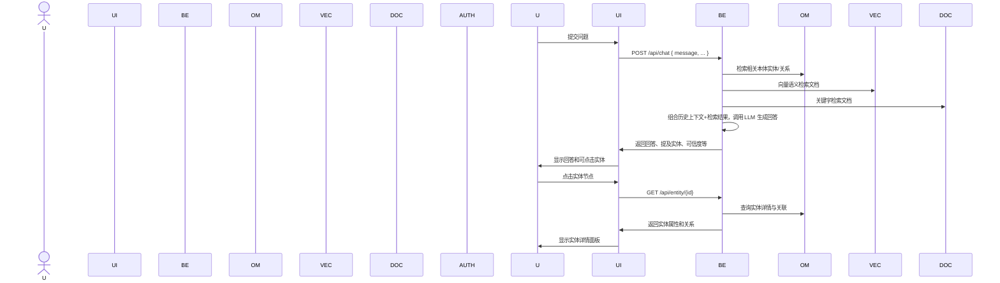

# Open Ontology 与类 ChatGPT 智能体集成框架设计

**执行摘要：** 本方案旨在设计一个完整的应用层框架，将已有的本体（Ontology）管理系统与类ChatGPT智能体（后端Agent）能力紧密结合。其核心思想是利用本体提供结构化知识和语义信息，增强智能体的回答质量与可解释性，同时在前端对话界面可视化展示涉及的本体实体和关系，支持查看实体详情、对话历史、来源证据和权限提示。架构分为前端、后端、数据层和接口部分：后端基于LangChain/DeepAgent等Agent框架，通过构建检索-推理流水线实现本体查询和知识检索融合；前端以React/Vue等框架实现对话面板、关系图、详情面板、证据面板和权限提示等组件，利用可视化库（如AntV G6）展示实体关系；数据层包括本体图数据库、向量数据库和文档知识库等，用于存储语义数据和对话历史；接口层提供REST/WebSocket/GraphQL等API供前后端交互。我们将采用GraphRAG（基于本体图的检索增强生成）、混合检索策略和上下文管理（如Graphiti知识图谱记忆）等技术，确保回答的可信度和可追溯性。考虑性能与扩展性，通过异步并发、向量索引和缓存等优化。安全与合规方面，利用基于角色的访问控制、输出校验和审计日志等措施应对LLM常见风险【42†L1-L4】。最后，给出详细的技术选型建议（后端框架、数据库、前端框架、可视化库、部署方案等）及对比表，示例API/JSON Schema和Mermaid序列图，以及实施路线图和评估指标，为落地实施提供全面参考。

## 架构总览

整体架构由**前端界面**、**后端服务**和**数据层**三大部分组成（如下图所示）。前端采用现代Web框架（如React/Vue）提供用户对话和可视化组件；后端包括API网关、Agent核心（整合LLM和多种工具）、本体服务、检索服务、权限服务和日志服务；数据层包含本体图数据库、向量数据库、文档/知识库和对话历史存储等。前后端通过REST/WebSocket/GraphQL接口交互，对话请求由后端Agent处理，后端调用本体服务和检索服务获取结构化知识和文档内容，再交由LLM生成答案并返回给前端；前端在答案中高亮可交互实体，用户可点击查看实体详情和证据。下图使用Mermaid语法示例架构组件及数据流关系：  

```mermaid
graph LR
  subgraph 前端 (Frontend)
    UI_CHAT[对话面板]
    UI_GRAPH[关系图可视化]
    UI_DETAIL[对象详情面板]
    UI_EVID[证据/来源面板]
    UI_AUTH[权限提示弹窗]
  end
  subgraph 后端 (Backend)
    APIGW(API 网关<br/>(REST/WebSocket/GraphQL))
    AgentCore[Agent 核心<br/>(LLM、LangChain/DeepAgent)]
    OntologyAPI[本体服务]
    Retrieval[检索服务 (RAG/向量检索)]
    AuthService[权限鉴权服务]
    Logging[审计/日志服务]
  end
  subgraph 数据层 (Data)
    OntoDB[(Ontology 图数据库)]
    VectorDB[(向量数据库)]
    DocDB[(文档/知识库)]
    ChatDB[(会话日志存储)]
    AuditDB[(审计日志存储)]
  end

  UI_CHAT -->|提问| APIGW
  APIGW --> AgentCore
  AgentCore --> OntologyAPI
  AgentCore --> Retrieval
  Retrieval --> VectorDB
  Retrieval --> DocDB
  OntologyAPI --> OntoDB
  AuthService --> OntoDB
  AgentCore --> AuthService
  AgentCore --> Logging
  APIGW --> ChatDB
  UI_CHAT --> UI_GRAPH
  UI_CHAT --> UI_DETAIL
  UI_CHAT --> UI_EVID
  UI_CHAT --> UI_AUTH
  UI_GRAPH <--> APIGW
  UI_DETAIL <--> APIGW
  UI_EVID <--> APIGW
  UI_AUTH <--> APIGW
```  

如上图所示，**前端组件**包括对话面板（展示问答历史并提供输入）、关系图可视化区域、实体详情面板、证据/来源面板及权限提示弹窗；**后端服务**则负责接收用户请求、协调Ontology服务和检索服务、调用LLM生成答案，以及处理权限验证和日志审计等。

## 模块划分与职责

- **API网关 (API Gateway)**：提供对外RESTful/GraphQL/WebSocket接口，路由请求至Agent核心；负责会话管理、请求参数校验和响应格式化。
- **Agent 核心 (AgentCore)**：基于LangChain、DeepAgent或自研框架实现，多轮对话管理与调度。核心职责包括：解析用户意图、维护对话上下文、调用LLM生成回答，并集成各种工具（如本体查询、向量检索、知识库查询等）。Agent可以使用链式调用或代理（Planner）策略，决定何时调用本体查询或外部工具，以动态获取所需知识。
- **本体服务 (OntologyAPI)**：封装现有本体管理基础设施（如RDF/OWL存储、属性图数据库等），提供实体和关系查询接口。它将自然语言请求或实体标识转为本体查询（如SPARQL/Cypher），并返回符合权限的对象集合或三元组。该模块负责确保返回的数据符合语义模型，执行并发优化和缓存策略。
- **检索服务 (Retrieval)**：负责文本和向量检索任务，增强LLM生成。包括对知识库/文档库的全文检索和对向量数据库（如Milvus、Pinecone）的语义搜索；将检索结果与本体关联的上下文一起提供给Agent，构建丰富的回答上下文。可以采用混合检索策略（GraphRAG），比如先做向量语义搜索，再进行图查询，或并行多路检索后融合结果。
- **权限鉴权服务 (AuthService)**：管理用户身份与数据访问权限。它根据用户角色和本体定义的访问控制策略（如字段级/节点级ACL）判断用户对实体/关系的可见性。在前端尝试访问敏感实体时弹出权限提示。Palantir AIP Agent Studio 即强调**最小权限原则**：LLM只能访问完成任务所需的最少对象【37†L39-L44】。
- **日志与审计 (Logging/Audit)**：记录对话历史、查询和回答的来源，追踪Agent决策链路，用于事后审计和性能监控。日志包括用户提问、调用的工具/本体查询、LLM回答和置信度等信息，满足合规审计需求。

各模块间通过清晰接口交互：AgentCore调度本体查询与检索服务，本体服务访问本体数据库，检索服务访问向量/文档数据库，权限服务在每步查询前后校验访问合法性。下面是用户问答过程的序列示例：  



## API/消息协议与数据格式

系统对外提供多种接口形式以支持不同需求：  

- **REST API**：标准的聊天和查询接口，例如：  
  - `POST /api/chat` 接受 JSON 请求体 `{ "userId": "...", "conversationId": "...", "message": "..." }`，返回结构 `{ "reply": "...", "entities": [...], "confidence": 0.x, "sources": [...], "timestamp": "..." }`。  
  - `GET /api/entity/{id}` 返回该实体的详细信息和关联关系。  
  - `GET /api/history/{conversationId}` 返回对话历史记录列表。  
- **WebSocket**：用于实时双向通信，前端建立WebSocket连接，发送用户消息事件，服务端流式返回Agent回答和更新（适用于长回答或多媒体场景）。消息格式可设计为 `{ type: "chatRequest", payload: {...} }` 和 `{ type: "chatResponse", payload: {...} }`，支持增量回答推送。  
- **GraphQL**：对于前端可视化查询，可以使用GraphQL提供更灵活的查询。例如：  
  ```graphql
  query GetEntity($id: ID!) {
    entity(id: $id) {
      id
      name
      type
      attributes {
        key
        value
      }
      relations {
        type
        target { id name type }
      }
    }
  }
  ```  
  这样的查询返回指定实体的完整结构。GraphQL Schema 可定义 `ChatMessage`, `Entity`, `Relation` 等类型。  

下面给出REST接口的请求/响应示例及对应的JSON Schema：  

```json
// 请求示例（REST: /api/chat）
POST /api/chat HTTP/1.1
Content-Type: application/json

{
  "userId": "u123",
  "conversationId": "conv456",
  "message": "查询订单123的状态",
  "locale": "zh-CN"
}
```

```json
// 响应示例
HTTP/1.1 200 OK
Content-Type: application/json

{
  "reply": "您的订单123已发货，预计3月20日送达。",
  "entities": [
    {"id": "Order:123", "type": "订单"}
  ],
  "confidence": 0.87,
  "sources": ["物流系统API", "本体:订单实体"],
  "timestamp": "2026-03-17T11:45:00Z"
}
```

```jsonschema
{
  "type": "object",
  "properties": {
    "userId": { "type": "string" },
    "conversationId": { "type": "string" },
    "message": { "type": "string" },
    "locale": { "type": "string" }
  },
  "required": ["userId", "message"]
}
```  

GraphQL 示例：  

```graphql
query {
  entity(id: "Order:123") {
    id
    name
    type
    attributes { key value }
    relations {
      type
      target { id name type }
    }
  }
}
```  

消息格式上，前端与后端交换的ChatMessage可定义为一个JSON对象，其中包含用户ID、会话ID、消息内容、语言等字段；后端回应则包含答案文本、涉及的实体列表、关系信息、可信度和证据来源列表等字段。所有消息都应符合严格的JSON Schema并做输入验证，以保证系统稳定可靠。

## 本体与 Agent 的集成模式

本方案采用多种模式将本体知识与智能体能力融合：

- **知识检索 (Retrieval)**：Agent根据用户提问，从本体数据库中检索相关实体及其属性/关系，用于提示上下文。例如，查询订单状态时先在本体中定位“订单123”实体，获取其属性，再将其摘要加入LLM提示词。可将本体数据与向量/文档检索结果共同作为Context。注意RAG（检索增强生成）通常只用文档，此处我们引入GraphRAG概念——使用本体图检索。正如Neo4j+LangChain案例所示，GraphRAG流程中LLM先生成Cypher查询，通过GraphCypherQAChain查询图数据库，然后LLM根据原始问题和图查询结果生成答案【24†L199-L207】。这种方式能有效减少幻觉。
- **语义推理 (Reasoning)**：除了直接检索，本体还可用于逻辑推理（推导规则）。Agent可调用逻辑推理引擎（如本体推理器、Drools等）对本体中的规则进行推理，生成新的事实或回答。例如利用OWL/RDFS推理继承类别或关系。虽然目前最主流的是基于LLM的隐式推理，但对于需要严格合规的场景，可结合显式本体推理工具校验LLM输出。
- **链式调用 (Chained Tool Calls)**：在LangChain等框架中，可以设计多步链：第一步调用本体查询工具获得结构化数据，第二步调用向量检索工具获取文档支持，再将这些结果传给LLM。如此构建流水线。例如，用户问复杂问题时，Agent可以先调用本体查询到相关实体，再用向量检索获取最新信息，最后综合回答。LangGraph扩展支持从早期步骤提取状态丰富提示，允许在多个阶段使用LLM，并根据问题动态路由查询至图查询或向量检索分支【24†L228-L237】【24†L259-L266】。
- **工具调用 (Tool Use)**：本体服务和检索服务都作为LLM的工具（Tool）集成。LLM生成含工具调用的JSON指令（如调用GraphQL或cypher查询），LLM Plugin执行对应操作并返回结果，LLM再整合结果生成回答。LangChain中的工具调用模式（ToolCall）适用于这种场景。通过这种方式，LLM本身不直接访问数据库，而是调用接口执行查询，可以更好地控制权限、校验和错误处理。

这些模式可以混合使用。系统需实现一个查询路由策略：根据提问类型自动决定调用模式。举例：“简单事实查询”可先做向量检索，检索到的关键词再转换为本体查询；而“关系查询”则直接做Cypher查询。LangGraph演示了基于条件入口点（GraphState）决定查询线路的设计【24†L259-L266】。

## 知识检索与上下文管理策略

为了让Agent高效利用知识，需要设计完善的检索和上下文管理策略：

- **混合检索 (Hybrid Retrieval)**：结合向量语义搜索和图数据库查询。一般流程可为：首先对用户提问做向量相似度检索（在知识库或历史对话中找相关片段），同时对问题中的关键词进行本体实体提取并查询图数据库。然后将向量结果与图查询结果融合，例如将图数据摘要加入prompt。GraphRAG就是典型模式，如“关于气候变化的文章”：先用向量检索找到几个相关论文，再用Cypher查询这些论文的作者和机构【24†L219-L227】。
- **上下文注入 (Context Injection)**：利用会话历史和领域知识构造LLM提示词。可使用图记忆（Graphiti/Zep）管理长期上下文，将过去对话和业务数据构建成时序知识图，Agent提问时从该知识图检索相关事实补充上下文【25†L26-L34】【4†L381-L389】。Graphiti框架强调将用户交互和结构化数据持续整合为可查询图【4†L381-L389】，每个事实都有时间标签和溯源（“episode”），使上下文查询更准确【4†L413-L421】。
- **会话记忆 (Session Memory)**：保持当前对话的短期记忆。Agent应该跟踪对话中的实体引用和上文内容，将已提及的实体和主题作为后续回答的上下文。技术上可以将对话历史文本向量化后存储，或持续维护一个轻量知识图以快速检索相关上下文句子。
- **动态摘要 (Dynamic Summarization)**：对于超长对话或知识库，当信息超过模型上下文窗口时，需要对历史进行压缩。可以对老的对话段落或检索结果进行摘要，只保留关键事实加入新的prompt。Graphiti/Zep中“社区节点”概念可为聚簇实体生成高层次摘要【25†L108-L117】。
- **验证与迭代**：对于关键答案，可设计后置检查模块（如再次在知识图上验证答案是否与事实匹配）或要求LLM输出推理链（chain-of-thought）并对照本体验证。确保高置信度回答并降低幻觉。

通过以上策略，系统能够动态管理知识上下文，使LLM在生成回答时既参考最新文档信息，又结合结构化本体背景。例如，在企业场景下，对话助手可以将业务流程本体与对话历史构成的上下文提供给模型，使回答更具专业性和准确性。

## 实体/关系可视化设计与交互流程

前端可视化交互部分重点展示回答中涉及的本体实体和关系，并支持丰富的用户交互。建议的组件包括：  

- **对话面板**：仿ChatGPT样式的对话窗口，展示用户提问和Agent回答，回答中检测到的实体名称呈可点击样式。用户可以选中任意实体名称，以触发详情展示或关系图聚焦。  
- **关系图 (Knowledge Graph) 可视化**：使用关系图引擎（如AntV G6/Graphin）动态绘制回答相关实体及其连接关系。每个节点代表实体（不同颜色区分类型），边表示关系。图可采用力导向布局，高亮当前回答涉及部分。本体图可交互：用户悬停或点击节点可弹出简要信息，单击后在详情面板显示完整属性、下一级关系。图示支持实时缩放和拖拽。示例可参考下图：在合同管理场景中，本体模型的可视化将流程、对象、行为和规则融合为一个网络（节点按类别着色），能够动态过滤和模拟场景流程【14†L105-L113】【14†L113-L116】。  

【30†embed_image】 图中展示了合同管理业务的本体模型可视化，将业务流程、场景对象、行为和规则整合为一个完整知识网络【14†L105-L113】。用户可以基于流程筛选相关部分。  

【31†embed_image】 如上，选择“合同创建”流程时，仅显示该流程相关的对象、行为和规则，以清晰展示它们之间的依赖关系【14†L113-L116】。  

【32†embed_image】 在该示例中，点击“动态模拟”按钮可逐步演示“客户创建”流程：图中节点依次标注执行步骤，边上标注顺序，使用户直观理解流程调用顺序【14†L121-L128】。  

- **实体详情面板**：当用户点击图中节点或回答中的实体时，侧边弹出实体详情面板，列出该实体的属性（字段名/值）和与其它实体的关系。若实体关联复杂，可分页或分组显示关系。如“订单”对象详情包括订单号、状态、创建时间等属性，以及与“客户”、“商品”实体的关联。详情面板也可包括对实体定义和备注的解释。
- **证据/来源面板**：提供支持回答的原始数据来源，展示Agent使用的知识证据。例如列出回答中引用的文档片段、数据库记录或本体条目（附带链接）。用户可点击查看原文上下文。通过展示证据路径，增强回答可信度。可将来源按类型（文本/知识库/本体）分类。
- **权限提示弹窗**：在用户尝试访问受限信息时弹出。例如若回答中涉及敏感实体（如财务、个人信息），对未授权的用户弹出权限提醒（需进一步身份验证或展示许可提示）。设计友好的提示，说明数据隐私要求和申请权限的流程。

前端交互流程示例：用户提问后，对话面板显示答案；实体以链接形式出现，点击时前端发起对应实体详情API请求；服务端返回数据后在详情面板呈现；同时可在关系图高亮或居中该节点；用户在证据面板可查看支撑该回答的证据信息；若某实体无权限查看，则弹出权限提示并引导申请或遮挡敏感内容。

## 可信度、溯源与证据链

提升回答可信度和可审计性是系统核心目标之一。具体措施包括：

- **证据追溯**：在回答中附带回答所依赖的“证据”。例如，在返回结果中包含`"sources"`字段，注明该答案参考的文档ID、本体实体、数据库记录等。Graphiti/Zep框架将每条事实与原始“episode”关联【4†L413-L421】；我们也应对每个回答记录其在知识图或文档库中的来源路径。用户可查看“证据面板”中的这些来源，验证答案出处。
- **置信度评分**：Agent核心可对答案或各证据片段输出置信度。例如基于LLM输出概率、检索工具打分、答案一致性等多因素计算一个综合置信度。前端在回答旁显示置信度条或标签，让用户了解答案可靠程度。若置信度低，可在提示中附加“不确定”说明。
- **多轮验证**：对于重要查询，可设计内置的交叉验证机制：例如使用不同的工具链（若回答冲突时，多个工具返回不同答案），或再次询问另一模型验证。确保不输出明显错误信息。还可利用数据校验规则（如字段约束、本体一致性）来判断答案是否合理。
- **可解释的回答**：引导LLM给出解释性输出（rationales或思路）或结构化回答，使用户可以看到推理过程。结合本体知识，可以生成包含推理路径的“解释包”：包括答案本身、相关实体关系链和文本证据。例如输出“知识图路径：订单123→状态→已发货；文档片段：‘订单123已于昨日发出’”等。
- **数据审计**：所有查询和回答记录到审计日志，便于事后检查回答依据。可统计常见错误模式，优化提示。审计日志还用于合规审计（记录哪些用户在何时访问了哪些敏感实体）。

通过以上方法，用户不再只看到黑箱式回答，而能追溯每条信息的来源，从而降低LLM“幻觉”产生的风险。Graphiti项目即强调“证据-路径-策略”的说明包（answer + evidence paths + provenance + policy）概念【11†L50-L59】，我们的设计亦以此为目标，使系统输出既准确又可解释。

## 权限与隐私控制

系统将涉及企业内部及用户敏感数据访问，需遵守安全与隐私原则：

- **细粒度访问控制**：基于本体定义的ACL，在实体、属性或关系层面控制访问。例如不同用户角色可访问不同类型的实体属性。按照Palantir AIP建议，LLM仅被授予完成任务所需的最小权限【37†L39-L44】。实现方式可以是：API层接入统一身份认证（如OAuth2），并在本体查询时附带用户角色，OntologyAPI仅返回允许查看的数据。
- **数据加密与传输安全**：对话历史、知识库和本体数据都应在存储和传输中加密。使用HTTPS/TLS保护前后端通信，敏感字段可在DB层面加密。
- **隐私脱敏**：对于特定领域（如医疗、财务）的敏感信息，必要时自动脱敏再展示，比如只展示部分字段或做摘要，避免泄露个人信息。
- **输入输出过滤**：防止用户通过对话注入恶意内容或敏感信息。对用户输入进行安全审计（如敏感信息检测、正则过滤），对LLM输出做检查（如通过内置规则或过滤器检测是否输出违规内容）。
- **合规审计和策略**：记录和监控对话日志，对数据访问行为定期审计，符合GDPR、CCPA等规定。实施角色分离和多方审批流程，如果回答涉及高敏数据，需要审批后才能获取。
- **对抗攻击防范**：根据OWASP LLM安全指南，对以下风险进行防范【42†L1-L4】：  
  - 不安全的输出处理（输出内容检查，防止泄露敏感信息）。  
  - 供应链漏洞（确保使用的模型、依赖库来源可信，并及时打补丁）。  
  - 敏感信息泄露（通过脱敏、加密、严格访问控制防范）。  
  - 过度授权（LLM运行环境隔离，对关键资源使用权限审计）。  
  - 过度依赖（设置人工复核流程，对关键答案由人工审核）。  

通过上述技术和策略，可在提供强大知识驱动对话的同时保障数据安全和用户隐私。

## 性能与扩展性考虑

- **并发处理**：后端采用异步架构（如基于FastAPI/Node/Kotlin协程等），可同时处理多个用户请求。利用消息队列（Kafka/RabbitMQ）调度长任务（如知识检索），避免阻塞主线程。必要时可用负载均衡和多实例部署（Kubernetes）水平扩展服务实例。
- **检索效率**：向量数据库（如Milvus/Pinecone）提供亚秒级检索性能；对本体数据库（Neo4j等）使用索引优化或分片集群，减少图查询延迟。在多步骤Agent流程中，可缓存热点查询的结果或上下文（Memory Buffer），避免重复开销。
- **延迟优化**：对于交互体验，尽量控制回答生成时延。例如使用快速响应的中小模型辅助RAG预回答，再异步补充最终答案。对于大型LLM调用，可采用流式输出让用户先看到部分回答。
- **可扩展数据**：数据层要支持动态扩展。向量库和知识库容量应能随企业规模增长而扩展；采用分库分表或分布式数据库(如ArangoDB、JanusGraph+Cassandra)等方式存储大规模本体。架构需支持动态加载新知识源（如企业新系统的数据、爬取的新文档）并自动索引。
- **多语言与跨域**：如果需要支持多语言对话或跨领域，应在系统中引入多语言模型和本体映射策略，并对不同业务领域配置不同的本体子集。
- **可维护性**：采用模块化、微服务或插件化设计，确保后续可插拔新的检索工具（例如接入第三方知识API）或替换模型。同时提供监控（Prometheus/Grafana）和日志跟踪（LangSmith 等）工具，对请求链路进行可观测，及时发现瓶颈。

## 技术选型建议

针对各层面推荐如下技术栈，并列出优缺点：

- **后端开发框架**  
  | 技术   | 优点                                    | 缺点                                  | 适用场景            |
  |--------|-----------------------------------------|---------------------------------------|---------------------|
  | Python (FastAPI/Flask)  | 庞大AI生态（PyTorch、TensorFlow、LangChain等支持完善），开发快速，支持异步编程（FastAPI）。 | 单线程场景下性能逊于Java；需要注意GIL限制。 | 快速原型、小中型应用。    |
  | Java (Spring Boot)      | 性能高、类型安全、企业级支持完备；生态成熟，便于与现有企业系统集成。 | 学习成本高，开发迭代相对慢；较重（适合大型应用）。 | 金融、政府等对稳定性要求高的大型系统。 |
  | Node.js (Express/Koa)   | JavaScript全栈开发，I/O密集应用性能优秀；社区活跃、库丰富。 | 单线程模型不适合CPU密集型任务；需谨慎管理并发。 | I/O密集、实时通信（聊天）场景。 |
  | Go                     | 高性能并发，编译后部署轻量；内置并发模型易于水平扩展。 | AI相关库相对较少（可调用Python服务）；生态较年轻。 | 对并发性能要求极高的后端服务。 |

- **向量数据库 (Vector DB)**  
  | 技术       | 优点                                         | 缺点                               | 备注                  |
  |------------|----------------------------------------------|------------------------------------|-----------------------|
  | Milvus     | 开源免费，高性能（支持CPU/GPU），社区活跃；功能全面（ANN、多索引）。 | 部署运维复杂度高，需要管理服务集群。     | 推荐用于大规模向量检索；      |
  | Pinecone   | 全托管服务，易用性高，水平可扩展；专为大规模向量搜索优化。 | 收费（SaaS模式），对私有部署有限制。      | 适用于快速上线和企业级场景。  |
  | Weaviate   | 开源，内建GraphQL接口，多模态集成（支持知识图）；支持向量+RDF。 | 社区较新，功能不及Milvus成熟。         | 当需要图形查询与向量检索结合时可选。 |
  | FAISS/Elasticsearch | FAISS：算法灵活、高性能；ElasticSearch：支持向量插件，易与其他功能集成。 | FAISS：无服务层，需要自行开发REST接口；ElasticSearch：向量功能非主线，搜索效果次。 | 适合作为嵌入式库或补充方案。  |

- **知识图谱数据库/本体存储**  
  | 技术            | 优点                                         | 缺点                             | 备注               |
  |-----------------|----------------------------------------------|----------------------------------|--------------------|
  | Neo4j           | 业界领先的图数据库，ACID事务、Cypher查询语言直观；可视化工具丰富【24†L199-L207】。 | 企业版收费；单实例扩展有限（有集群方案）。 | 中大型知识图应用首选。 |
  | Apache AGE/Grafana等 RDF引擎 | 原生支持RDF/OWL标准，适合本体语义存储；可使用SPARQL查询。 | 性能和易用性一般；需要专业本体知识维护。 | 本体标准化场景，如语义Web。 |
  | ArangoDB        | 多模型数据库（文档+图），支持AQL查询；灵活。 | 社区相对较小，生态不如Neo4j丰富。 | 适合存储对象图+文档混合数据。 |
  | AWS Neptune    | 托管图数据库，支持Gremlin/SPARQL，易扩展。 | 云服务依赖，成本高，锁定AWS生态。 | 已采用AWS的大型企业可选。 |
  | JanusGraph + 存储 | 可与Cassandra/HBase/Elasticsearch结合，支持海量数据分布式。 | 部署复杂，需运维多系统。         | 数据量极大且需高可用时考虑。 |

- **前端框架**  
  | 技术        | 优点                                        | 缺点                                 |
  |-------------|---------------------------------------------|--------------------------------------|
  | React       | 生态庞大，组件库丰富（Ant Design、Graphin等），社区活跃；虚拟DOM性能好。 | 学习曲线平缓但需要掌握JSX和状态管理；仅负责View层。 |
  | Vue         | 语法简洁，上手快，中文文档丰富；响应式绑定方便。 | 生态不如React庞大，工作应用市场份额略低。           |
  | Angular     | 框架完整，企业支持，TypeScript优势；内置大量功能。 | 学习成本高（概念多：DI、Zone等），过重。             |

- **可视化库**  
  | 库/工具             | 优点                                             | 缺点                                    |
  |---------------------|--------------------------------------------------|-----------------------------------------|
  | AntV G6 / Graphin   | 专注关系图可视化，提供灵活的力导向布局和动画【19†L79-L87】；Graphin是其React组件封装，易用性高。 | 学习成本较高，需要理解G6模型；UI组件较少。     |
  | ECharts (Graph)     | 知名度高，社区活跃；开箱即用，可处理中小规模关系图。   | 功能固定，复杂交互定制能力不足；主要图表用例。  |
  | D3.js               | 极高自由度，可自定义任何类型图表；生态丰富示例多。     | 学习曲线陡峭，需要扎实JavaScript知识。         |
  | Cytoscape.js        | 侧重生物/社交网络分析场景，支持大规模节点渲染；交互性好。 | 商业许可要求（部分高级功能收费）；适用领域专一。  |
  
- **部署方案**  
  | 方案                   | 优点                                    | 缺点                                      |
  |------------------------|-----------------------------------------|-------------------------------------------|
  | 容器化+Kubernetes      | 弹性伸缩、资源隔离强；便于多环境一致部署；丰富的监控和管理生态。 | 运维复杂度高，需要掌握容器编排技术；冷启动较慢。 |
  | 公有云服务（AWS/GCP） | 提供托管服务（数据库、向量搜索等）；可快速上线和自动扩容；全球化网络。 | 成本不透明可能较高；对数据安全和合规有依赖（需额外配置）。 |
  | 私有部署（自建机房）   | 数据完全可控，满足严格合规；无需担心公有云价格波动。     | 前期投入大；扩展性受限；需要自建基础设施和运维团队。 |
  | 混合云/边缘部署       | 兼顾数据安全和可伸缩性，灵活部署非敏感组件于云端。       | 架构和网络配置复杂；开发与运维工作量增加。 |

以上表格可根据项目规模和预算灵活选择。例如，中小企业可选择React+FastAPI+Milvus+Neo4j部署于云上快速迭代；大型企业可选Java+Kubernetes+AWS托管服务以保障规模和稳定性。

## 前端组件清单与交互原型

推荐的前端组件和交互功能包括：  

- **对话面板**：显示用户和Agent的对话气泡，用户在底部输入。回答中可高亮可交互实体。支持Markdown富文本或富媒体（如图片、表格）渲染。  
- **实体关系图**：显示当前回答涉及的实体关系网络图。节点可点击选中，选中后详情面板展开。用户可拖动、放大、缩小、搜索节点。图中不同颜色表示不同实体类型，图例展示类型说明。  
- **对象详情面板**：侧边栏形式，选中实体后弹出。列出实体所有属性（字段-值对）及简要说明，下面分组展示“关联对象”列表，每个关联可点击。可实现属性可复制（Copy）、切换显示密文等。  
- **证据/来源面板**：位于对话面板下方或弹出框，展示答案中引用的所有证据条目。包括文档节选、记录编号、本体三元组等，每条证据附带来源标签（如页面ID、数据库表名）。点击可展开查看上下文详细信息。  
- **权限提示框**：当用户尝试访问未授权的实体或执行敏感操作时，弹出模式对话框提示权限不足或敏感操作警告，并给出申请权限的提示或取消按钮。  

**交互原型建议流程**：用户在对话框提问后，系统显示答案并自动在关系图中突出相关实体。例如用户问“公司的最新财务指标是什么？”，回答中出现“财务报告2025”，系统在图中将节点高亮并提示可点击“查看详情”。点击该节点后，左侧详情面板展示报告属性（如收入、利润等），下方可能列出相关实体（“财务部门负责人”等）。同时证据面板显示该数据源出处（如数据库记录或文档片段）。在整个过程中，后端持续验证用户对财务数据的查看权限，如无权限则提示授权。

## 安全、合规与隐私风险及缓解

应用生成式AI时需要重点关注以下安全和隐私风险【42†L1-L4】【41†L88-L97】，并采取相应缓解措施：

- **不安全输出**：LLM可能输出未审校或敏感信息。**缓解**：对LLM回答实施后处理过滤（如过滤敏感词）、输出验证（与知识图比对一致性），必要时进行人工复核；在Prompt中指令模型仅输出事实，并按照Schema严格输出（可借助JSON Schema检验技巧【35†L7-L10】）。
- **敏感信息泄露**：用户输入或知识库中可能包含个人身份信息（PII）或商业机密。**缓解**：对话中启用隐私模式，自动识别并脱敏PII（如姓名、身份号）；对敏感实体实行最小权限控制，只展示必要字段【37†L39-L44】；所有数据传输和存储采用加密。
- **模型供应链风险**：使用第三方模型时需谨慎。**缓解**：优先使用经过验证和审计的模型；定期更新和检查依赖库；隔离执行环境，使用Docker/K8s容器运行LLM以防止逃逸。
- **过度授权/越权访问**：Agent可能调用本体/数据库越过权限限制。**缓解**：每次本体查询前通过AuthService验证用户权限【37†L39-L44】；实现细粒度访问控制策略，对不同环境、不同用户设置不同数据可见性。
- **过度依赖与自动化风险**：盲目信任AI回答可能导致决策错误。**缓解**：关键回答附带可查证来源，增加人机交互，让用户判断可信度；对于高风险领域（医疗、金融），增加人工审批或二次确认机制。
- **合规风险 (GDPR/法规)**：用户数据处理需符合当地法律。**缓解**：对用户对话日志和知识库中的个人信息提供删除/匿名化功能，确保用户可行使数据删除权；对跨境数据存储设定策略。
- **运营安全**：进行常规的安全测试和审计，包括渗透测试、依赖扫描和监控（如使用OWASP Top 10对AI应用安全措施【42†L1-L4】）。
  
通过以上措施，确保系统在提供智能对话的同时，保持高水平的安全防护和合规性。

## 测试与评估指标

系统开发完成后，应进行多维度评估：

- **回答质量**：使用标准问答数据集评测准确率、查全率等，同时进行人类专家评审（包括正确性、完整性和自然度）。可设计“基准问答集”（含正确答案和可支持证据），衡量系统的F1分数和答案可信度。  
- **答复可信度**：评估回答中错误或虚假信息的比例。可统计LLM输出中与知识库不符的回答次数，以及用户通过证据验证后的接受率。目标是答案准确率及可信率均>90%。  
- **响应时延**：测量端到端延迟（从用户提问到显示答案）和后端处理时间。要求一般回答延迟＜2s，复杂查询＜5s；检索和LLM调用均优化低延迟。  
- **吞吐量与并发**：在模拟多用户环境下测试系统并发处理能力（QPS、每秒请求数）和资源利用率。确定在目标部署规模下的并发限制并进行负载测试。  
- **可用性与容错**：对网络抖动、服务故障场景进行测试。确保组件故障可降级处理（例如本体服务不可用时依然使用缓存或仅文本回答）。  
- **可视化功能**：对前端UI进行可用性测试，包括实体交互、图形加载速度、移动端兼容性等。确保关系图在实体数量较大时仍能流畅展示。  
- **安全合规测试**：验证权限控制是否生效（尝试越权访问敏感实体）；测试数据加密是否正确；检查系统是否符合相关安全标准（如ISO27001、SOC2等，视行业需求）。  

通过上述指标的持续评估和测试，确保系统性能满足需求并及时迭代改进。

## 实施路线图与里程碑

针对没有特定预算和团队规模的假设，可按以下阶段逐步实施，预估时间和里程碑：  

1. **阶段1（1周）：需求分析与技术评估** – 梳理业务需求，完成架构设计和技术选型，绘制初步架构图和流程图。输出需求文档、原型框架。  
2. **阶段2（2周）：后端原型开发** – 搭建开发环境，接入LLM（如OpenAI/GPU本地模型），实现简单的RAG问答Demo；实现Ontology API接口雏形，测试基础本体查询功能。完成基本聊天接口和提示词构建流程。  
3. **阶段3（3周）：前端原型开发** – 开发对话面板和实体关系图组件示例，实现与后端的交互；集成可视化库（如AntV G6），展示简单的知识图。实现实体点击显示详情面板的Demo。  
4. **阶段4（2周）：检索与集成优化** – 集成向量数据库并进行测试检索效果（包含向量化知识库或文档）；优化链式流程（LangChain agents配置多种工具）。确保检索结果能正确注入对话上下文。  
5. **阶段5（2周）：安全与权限模块** – 实现用户认证和基本权限控制（RBAC），编写测试用例验证对敏感实体的访问限制。集成日志审计系统（记录API调用及对话）。  
6. **阶段6（1周）：性能测试与优化** – 对整体系统进行负载测试，优化瓶颈（如异步处理、增加缓存、并行调用）。收集指标，调整硬件/容器资源，达成性能目标。  
7. **阶段7（1周）：用户测试与迭代** – 小范围内部用户测试界面和问答质量，收集反馈改进交互细节和回答准确度。  
8. **阶段8（持续）：部署与维护** – 将系统部署到生产环境（云平台或私有云），监控运行状况。根据用户使用情况和新需求持续迭代，如引入新数据源、扩展本体体系、升级模型等。  

每阶段均设定可交付物和评估标准（如Demo系统、测试报告等）。整体预计首版上线时间约8-10周，后续每2-4周一个迭代周期，根据需求动态调整迭代内容（如支持更多领域、优化LLM提示）。

以上设计与规划提供了一个面向企业级场景的**本体+智能体集成平台**的详细方案。通过结构化知识与对话AI的深度结合，可实现可解释、可信赖且用户友好的智能问答应用。参考图表、示例及表格来自官方资料和公开技术文档【4†L375-L384】【24†L199-L207】【14†L105-L113】【37†L39-L44】【42†L1-L4】等，确保技术方案的权威性和实践可行性。  

